# Rust Core SDK Redesign

> **Superseded.** This is the v1 draft, kept for history. The current spec is [`rust-core-sdk-redesign-v2.md`](./rust-core-sdk-redesign-v2.md) (more detail, Go + Rust surfaces, per-step scope); the as-built architecture is [`architecture.md`](./architecture.md); step status is [`rust-migration-map.md`](./rust-migration-map.md). Do not use this document as a reference for new work.

Implementation-oriented architecture decision document for migrating SolvaPay’s shared SDK behavior into a Rust semantic core while preserving the existing TypeScript/React surface and adding idiomatic Python and Ruby packages.

**Status:** living document. Every migration step starts with online research against current upstream sources; findings that confirm, sharpen, or contradict a decision are written back here in the same session.

**Related docs:**

- Current package layout and runtime strategy: [`architecture.md`](./architecture.md)
- Public TypeScript surface: [`packages/server/src/index.ts`](../../packages/server/src/index.ts), [`packages/server/src/client.ts`](../../packages/server/src/client.ts), [`packages/react/src/index.tsx`](../../packages/react/src/index.tsx)
- OpenAPI type generation today: [`packages/server/scripts/generate-types.ts`](../../packages/server/scripts/generate-types.ts)

---

## 1. Goals

1. **One semantic core.** Models, validation, request construction, normalization, retries, paywall decisions, webhook verification, and shared MCP contracts live in Rust and are reused by every language binding.
2. **Cross-surface API parity (non-negotiable).** TypeScript, Python, and Ruby expose the same public capabilities, used in more or less the same way. Only surface syntax differs.
3. **Preserve the TS/React product surface.** Existing npm package names, React imports, and framework adapters stay stable throughout migration. Binding choice under the facade is invisible to `@solvapay/react`.
4. **Specialized bindings, not one raw C ABI for everything.** First-party wrappers use idiomatic toolchains (`napi-rs`, `wasm-bindgen`, PyO3, Magnus). A narrow versioned C ABI remains an optional portability layer for third parties.
5. **Session-sized translation.** Work lands as 49 ordered steps (Phases 0–8), each one PR with a verifiable “done when” check.

---

## 2. Cross-surface API parity

This is a primary success criterion, not a nice-to-have. A developer who knows the SDK in one language should recognize the same operations, arguments, defaults, errors, and results in another.

### 2.1 Single canonical public-API catalog

The SDK contract manifest (Phase 0) is the one source of truth for what “public” means. It enumerates every public entry point of the current SDK and maps it to an idiomatic name per language. No wrapper may add, omit, or silently rename a public entry point outside the catalog.

### 2.2 Portable surface — 1:1 parity required

All three wrappers must expose, with equivalent semantics:

| Category            | Current TypeScript anchors                                                                                         |
| ------------------- | ------------------------------------------------------------------------------------------------------------------ |
| Client factory      | `createSolvaPayClient`                                                                                             |
| Client methods      | Every `SolvaPayClient` method in `client.ts` (see catalog below)                                                   |
| Top-level functions | `verifyWebhook`, `withRetry`                                                                                       |
| Paywall helpers     | `buildPaywallGate`, `buildGateMessage`, `buildNudgeMessage`, `classifyPaywallState`, `paywallErrorToClientPayload` |
| Errors              | `SolvaPayError`, `PaywallError`                                                                                    |
| Core helpers        | `@solvapay/core` business-details, credit-display, seller-identity                                                 |

**`SolvaPayClient` methods (portable):**

`checkLimits`, `trackUsage`, `trackUsageBulk`, `createCustomer`, `updateCustomer`, `getCustomer`, `assignCredits`, `getMerchant`, `getPlatformConfig`, `getProduct`, `listProducts`, `createProduct`, `bootstrapMcpProduct`, `configureMcpPlans`, `deleteProduct`, `cloneProduct`, `listPlans`, `createPlan`, `updatePlan`, `deletePlan`, `createPaymentIntent`, `createTopupPaymentIntent`, `processPaymentIntent`, `attachBusinessDetails`, `cancelPurchase`, `reactivatePurchase`, `getUserInfo`, `getCustomerBalance`, `createCheckoutSession`, `createCustomerSession`, `activatePlan`, `getPaymentMethod`, `getAutoRecharge`, `saveAutoRecharge`, `disableAutoRecharge`.

### 2.3 High-level ergonomic facade — idiomatic equivalent required

`createSolvaPay(...)` in [`factory.ts`](../../packages/server/src/factory.ts) and its `payable` / `protect` gating ergonomics must have an idiomatic counterpart in Python and Ruby (for example a decorator in Python, a block/wrapper method in Ruby), driven by the same shared paywall decision core so gate/allow/paywall outcomes and copy match byte-for-byte across languages.

### 2.4 Explicit TypeScript-only exception

Framework glue does **not** need a Python/Ruby equivalent:

- `@solvapay/react`, `@solvapay/next`
- Framework adapters in [`packages/server/src/adapters`](../../packages/server/src/adapters/index.ts)
- Fetch route handlers in [`packages/server/src/fetch`](../../packages/server/src/fetch/index.ts)
- MCP SDK registration glue ([`register-virtual-tools-mcp.ts`](../../packages/server/src/register-virtual-tools-mcp.ts))
- `@solvapay/auth`, `@solvapay/cli`, `create-solvapay`, `@solvapay/init`

Python/Ruby still get the underlying decision cores those adapters call into (paywall gate, virtual-tool payload builders), just not the JS framework wiring.

### 2.5 Consistency rules

| Rule       | Requirement                                                                    |
| ---------- | ------------------------------------------------------------------------------ |
| Operations | Same set and semantics                                                         |
| Names      | Adapted only to language convention (`camelCase` TS, `snake_case` Python/Ruby) |
| Arguments  | Same shapes; same required/optional fields                                     |
| Defaults   | Same retry policy, idempotency, tolerances                                     |
| Errors     | Same taxonomy and stable `code` values                                         |
| Results    | Same shapes                                                                    |
| Sync/async | Equivalent availability per event-loop-ownership rules (§6)                    |

### 2.6 Enforced, not aspirational

A per-language parity/coverage check fails CI when any wrapper is missing a catalogued public entry point or diverges in signature/semantics. Shared golden fixtures run against all three wrappers. See Phase 0 (manifest + fixtures), Phases 2/7/8 (parity gates), and §9 (CI gates).

---

## 3. Current state (what we are migrating from)

Today the SDK is TypeScript-only across the monorepo (see [`architecture.md`](./architecture.md)):

- `@solvapay/core` — shared types, schemas, runtime-agnostic utilities
- `@solvapay/server` — server runtime, paywall, usage, webhooks, client, helpers, adapters
- `@solvapay/react` — provider, hooks, checkout UI (consumes the TS facade)
- OpenAPI → TS types via `generate-types.ts` filtering `/v1/sdk/*` (excluding `/v1/sdk/agents`)
- Node vs edge split for crypto (`verifyWebhook` sync in Node; Web Crypto path for edge)

Nothing in this redesign changes the public npm import paths or React component API during migration. Cutover happens under the existing facades.

---

## 4. Recommended architecture

### 4.1 Target-state component diagram

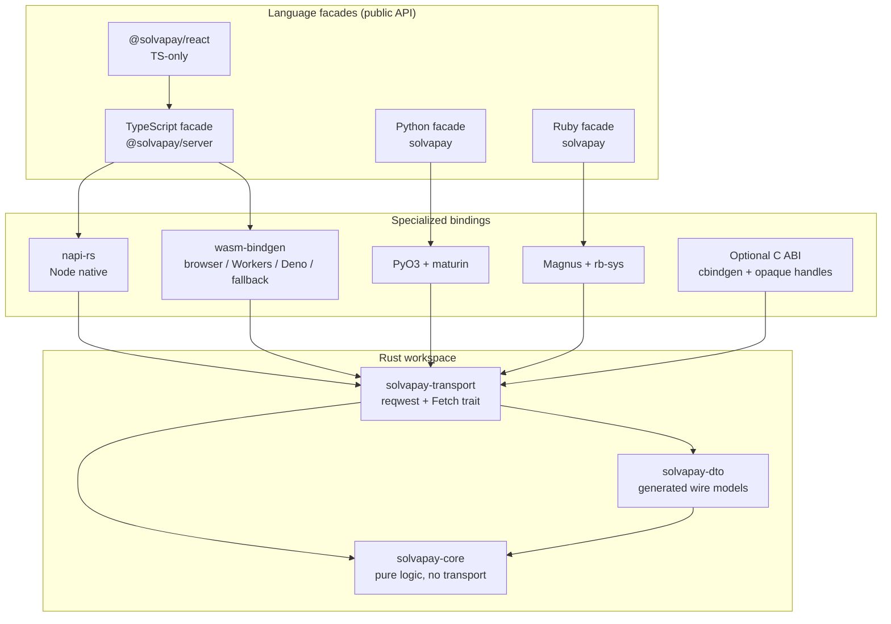

### 4.2 Layering and boundaries

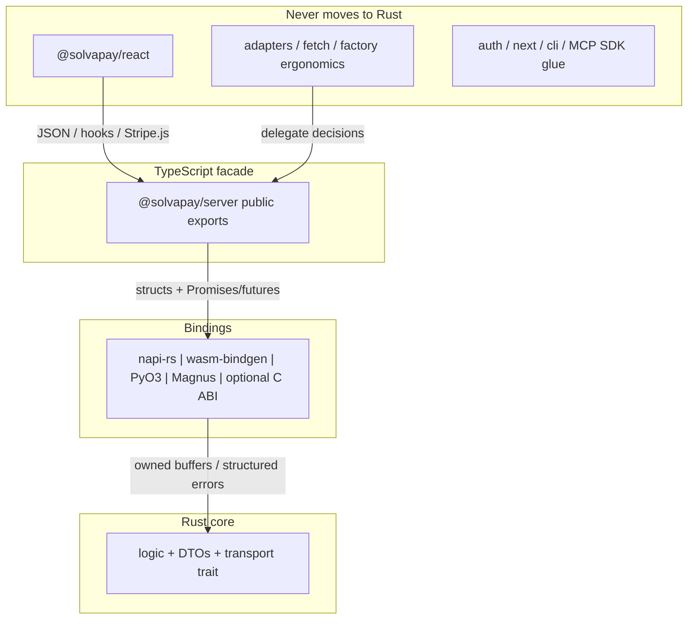

**What crosses each boundary:**

| Boundary            | Crosses                                   | Must not cross                                            |
| ------------------- | ----------------------------------------- | --------------------------------------------------------- |
| React → TS facade   | JSON, typed hooks, transport callbacks    | Secret keys, native handles                               |
| TS facade → binding | Structs/JSON, Promises                    | Framework objects (Request, Next.js types)                |
| Binding → core      | Owned buffers, typed errors, cancellation | Host event-loop types (tokio `Handle` in public core API) |
| Core → wire         | HTTP via transport trait                  | Language-specific exceptions                              |

### 4.3 Workspace split

| Crate                | Responsibility                                                                                                             | Deps                  |
| -------------------- | -------------------------------------------------------------------------------------------------------------------------- | --------------------- |
| `solvapay-core`      | Validation, retries (policy), webhooks, paywall state/gate, business-details, credit-display, seller-identity, error model | No HTTP; std allowed  |
| `solvapay-dto`       | Generated OpenAPI DTOs + SDK overlays                                                                                      | Generated; serde      |
| `solvapay-transport` | Transport trait, `reqwest`/rustls, Fetch-backed WASM, client shell, method implementations                                 | Depends on core + dto |

### 4.4 Binding strategy

| Target                          | Toolchain       | Notes                                                                |
| ------------------------------- | --------------- | -------------------------------------------------------------------- |
| Node TypeScript                 | `napi-rs`       | Prebuilds for platform matrix; WASM fallback when native unavailable |
| Browser / edge / Workers / Deno | `wasm-bindgen`  | Capability-separated builds; no secret-key ops in browser WASM       |
| Python                          | PyO3 + maturin  | Async + blocking sync facades; GIL released while awaiting           |
| Ruby                            | Magnus + rb-sys | Sync-first facade; GVL released during blocking calls                |
| Third-party / exotic            | Optional C ABI  | Opaque handles, owned buffers, explicit free, panic containment      |

### 4.5 Why not the alternatives

| Approach                                          | Why weaker for this target set                                                                                                                                                                                           |
| ------------------------------------------------- | ------------------------------------------------------------------------------------------------------------------------------------------------------------------------------------------------------------------------ |
| **Single raw C ABI for all first-party wrappers** | Forces every language through the least common denominator: manual memory, no idiomatic async, duplicated safety wrappers, and worse DX than napi-rs/PyO3/Magnus. Keep C ABI optional for portability, not mandatory.    |
| **UniFFI-only**                                   | Strong for Kotlin/Swift/Python/Ruby mobile-style components; Node and browser/WASM paths are second-class or third-party. We need first-class Node (napi-rs) and browser WASM (`wasm-bindgen`) for the existing product. |
| **Diplomat-only**                                 | Excellent C/C++/JS hub-and-spoke generator; Python via nanobind is newer; no first-class Ruby/napi-rs story matching our Node + PyPI + RubyGems matrix.                                                                  |
| **WIT / Wasm Component Model only**               | Promising long-term host model, but not a mature path for shipping idiomatic Node native addons, CPython wheels, and Ruby gems today. WASM remains our browser/edge/fallback path, not the universal packaging format.   |
| **WASM for every language**                       | Acceptable fallback for JS when native is missing; too slow/awkward as the primary Python/Ruby delivery (GIL/GVL, startup, tooling). Native extensions win for server SDKs.                                              |

**Decision:** specialized generated runtime bindings per language, with a stable optional C ABI for third parties.

---

## 5. Contract and code-generation strategy

### 5.1 Two inputs

1. **Checked-in filtered OpenAPI snapshot** — `/v1/sdk/*` paths (same filter as today’s [`generate-types.ts`](../../packages/server/scripts/generate-types.ts), excluding `/v1/sdk/agents`). Source of truth for wire DTOs. Upstream authorities: backend Zod schemas and the webhook event catalog.
2. **SDK contract manifest** — non-wire behavior and overlays: operation names, public method names per language, field normalization, errors, retries, idempotency, capabilities, sync/async semantics, and the `createSolvaPay` / `payable` / `protect` facade entry points.

### 5.2 What gets generated

From those two inputs:

- Rust DTOs (`solvapay-dto`)
- TypeScript declarations / facades
- Python stubs / facades
- Ruby RBS / facades
- C headers (optional ABI)
- Compatibility manifests
- Cross-language golden fixtures

### 5.3 Known schema blockers (fix before generation cutover)

These currently live as hand-maintained overlays in [`packages/server/src/types/client.ts`](../../packages/server/src/types/client.ts) and must be encoded in OpenAPI and/or the contract manifest:

| Blocker                                     | Today                                                                                 | Required before gen cutover                                          |
| ------------------------------------------- | ------------------------------------------------------------------------------------- | -------------------------------------------------------------------- |
| `CheckLimitsRequest.includeCheckoutSession` | TS intersection overlay; comment says temporary until OpenAPI republish               | Field in OpenAPI or explicit manifest overlay                        |
| `LimitResponseWithPlan`                     | `LimitResponse` + SDK-added `plan`                                                    | Document as overlay or push into API                                 |
| `ProcessPaymentResult`                      | Discriminated `oneOf` with recurring/one-time/topup/failed/cancelled/timeout branches | OpenAPI discriminators must round-trip; generator must preserve them |
| `CustomerResponseMapped`                    | Field mapping + optional purchase enrichments                                         | Manifest normalization rules                                         |
| SDK-only result types                       | `OneTimePurchaseInfo`, MCP bootstrap types, auto-recharge display blocks, etc.        | Manifest overlays with generation tests                              |

### 5.4 Compatibility model

- Generated TS declarations must be drop-in compatible with current exports during Phase 2 (API diff empty).
- Per-language parity/coverage check asserts every catalogued public entry point exists with matching semantics.
- Golden fixtures are the behavioral contract; bindings that diverge fail CI.

---

## 6. Portability, performance, and safety

### 6.1 Capability-separated builds

Browser and server builds are feature-gated so secret-key operations can never enter browser WASM. Server-capable bindings (napi-rs, PyO3, Magnus, server WASM for Workers with secrets held server-side) may include the full client; browser WASM exposes only public/safe operations the React transport needs.

### 6.2 std-based core (not `no_std`)

**Decision:** std-based core with size discipline, not `no_std`.

All targets (napi-rs, wasm32 browser/Workers, PyO3, Magnus) are hosted environments with std. `no_std` would forfeit `reqwest`/async ecosystem access with no performance gain.

Size control comes from:

- Workspace split (pure-logic crate free of transport deps)
- Cargo feature gates per target
- WASM profile: `opt-level = "z"` + LTO + `panic = "abort"`
- `wasm-opt`
- Lean dependency choices
- `twiggy` / `cargo-bloat` checks in CI against the WASM size budget

### 6.3 Concurrency model: async Rust

**Decision:** async Rust, not OS threads or CSP/actors.

Workload is I/O-bound request/response. Concurrency means overlapping in-flight requests; futures provide that on every target. WASM (browser/Workers) is single-threaded, so thread-based designs cannot ship there. Actor mailboxes add latency without isolation benefits for stateless calls. Channels are permitted only as an internal pattern (cancellation signals, any future background poller).

### 6.4 Runtime-agnostic core

- No tokio types or `tokio::spawn` in core public signatures
- `Send` bounds behind a cfg flag (tokio futures are `Send`; WASM futures are `!Send`)
- Enforced from Phase 1

### 6.5 Event-loop ownership (bindings, never the core)

| Binding       | Ownership                                                                        |
| ------------- | -------------------------------------------------------------------------------- |
| napi-rs       | Shared multi-thread tokio runtime; futures surface as JS Promises                |
| wasm-bindgen  | Host microtask queue via `wasm-bindgen-futures`                                  |
| PyO3          | Owns a tokio runtime; releases GIL while awaiting; async + blocking sync facades |
| Ruby (Magnus) | Sync-first facade; releases GVL during blocking calls                            |

### 6.6 Safety and interop checklist

| Concern                 | Rule                                                                                     |
| ----------------------- | ---------------------------------------------------------------------------------------- |
| Cancellation            | Drop-based via futures; bindings map host cancel/AbortSignal where available             |
| CORS / TLS              | Native: rustls. WASM: host Fetch + platform TLS. No custom browser TLS.                  |
| Webhook sync compat     | One Rust implementation; Node sync facade and edge/async facade both call it             |
| Opaque-handle lifecycle | C ABI: create/use/free pairs; no borrow across calls without explicit rules              |
| Allocator ownership     | Callee-allocated buffers freed by matching free functions; document ownership in headers |
| Panic boundaries        | `catch_unwind` at FFI edge; never unwind across language boundaries                      |
| Thread / GVL / GIL      | Binding owns release rules; core stays lock-light and async                              |
| Structured errors       | Stable `code` + message + optional details; map to `SolvaPayError` / language exceptions |

### 6.7 Release artifacts and target matrices

| Ecosystem                | Artifacts                                                 | Fallback                                                        |
| ------------------------ | --------------------------------------------------------- | --------------------------------------------------------------- |
| npm (`@solvapay/server`) | Native prebuilds (darwin/linux/win × arch) + WASM package | Load WASM when native missing/unsupported                       |
| PyPI                     | manylinux / macOS / Windows wheels via maturin            | Fail install clearly; no silent pure-Python stub for secret ops |
| RubyGems                 | Platform gems via rb-sys                                  | Document unsupported platforms; no silent stub                  |
| Optional C ABI           | Shared library + cbindgen headers                         | Third-party responsibility                                      |

All artifacts are version-stamped in lockstep with the SDK release train.

### 6.8 Measurable budgets (placeholders until Phase 6 baselines)

| Metric                        | Initial budget                                          | When enforced   |
| ----------------------------- | ------------------------------------------------------- | --------------- |
| WASM gzipped size             | Set baseline in step 38; regress < 10% without approval | Phase 6+        |
| Cold start (WASM init)        | Baseline in step 38                                     | Phase 6+        |
| Request overhead vs TS client | Shadow mode: median delta within agreed %               | Phase 3+        |
| Extra memory copies at FFI    | Prefer zero-copy / single encode per hop                | Binding reviews |
| Binary coverage               | Platform matrix green on main                           | Phase 6+        |
| Unsupported platform          | Documented error + WASM fallback for Node               | Phase 6+        |

Do not make unqualified performance claims; cite these budgets.

---

## 7. What never moves to Rust

| Area                                                                                     | Reason                                               | Compatibility guarantee                                                                                                                      |
| ---------------------------------------------------------------------------------------- | ---------------------------------------------------- | -------------------------------------------------------------------------------------------------------------------------------------------- |
| Entire [`packages/react`](../../packages/react)                                          | Components, hooks, Stripe.js, i18n, transport wiring | Consumes only the TS facade of `@solvapay/server`; binding beneath is invisible. React package tests are a regression gate at every cutover. |
| Adapters + fetch handlers                                                                | Thin TS shells                                       | Delegate to Rust decision/client cores                                                                                                       |
| `createSolvaPay` factory ergonomics                                                      | Language-idiomatic facade                            | Decisions it calls into move; factory stays TS (Python/Ruby get their own idiomatic facades)                                                 |
| `@solvapay/auth`, `@solvapay/next`, `@solvapay/cli`, `create-solvapay`, `@solvapay/init` | Product/framework glue                               | Unchanged                                                                                                                                    |
| MCP SDK registration glue                                                                | JS SDK types                                         | Payload builders move; registration stays TS                                                                                                 |

---

## 8. Step-by-step translation path

### Sizing rule

Every numbered step is scoped to **one Cursor session**: one module or small module group, one PR, one “done when” check that a fresh agent can verify without context from earlier sessions. No step may depend on unfinished work from a step after it.

### Diagram rule

Architecture must stay visible at every stage. Required Mermaid diagrams live next to the sections they explain. A step that changes the architecture updates the affected diagram in the same session (same rule as research findings).

Required diagram set:

1. Target-state component diagram (§4.1)
2. Layering diagram (§4.2)
3. Per-phase migration snapshots (below)
4. Sequence diagrams for subtle flows (§10)

### Research rule

Every step **starts** with online research against current upstream sources before writing code: docs and release notes for whichever layer the step touches (napi-rs, wasm-bindgen/wasm-pack, PyO3/maturin, Magnus/rb-sys, cbindgen, reqwest/rustls, the Rust FFI omnibus and unsafe code guidelines, WASM/Workers platform limits).

Findings that confirm, sharpen, or contradict a decision are written back into **this document** in the same session so it remains the current source of truth on portability, FFI patterns, and C ABI practice—not a snapshot of what was true when first written.

**Living-document update workflow:**

1. Open the step; identify touched toolchains.
2. Read current upstream docs/release notes; note version pins.
3. If a finding changes a decision, edit the relevant section here and mention it in the PR.
4. Implement the step; update any affected Mermaid diagram.
5. Verify the step’s “done when” check.

---

### Phase 0 — Contract freeze and golden fixtures (no Rust yet)

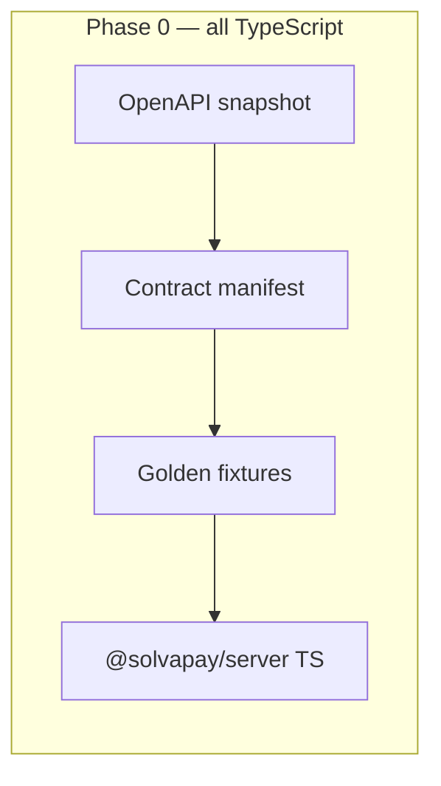

1. **OpenAPI snapshot + regen script.** Check in the filtered `/v1/sdk/*` OpenAPI snapshot plus the script that regenerates and diffs it.  
   **Done when:** regeneration is idempotent in CI.

2. **SDK contract manifest.** Single canonical public-API catalog (operation names, per-language method names for TS/Python/Ruby, normalization, retry/idempotency semantics, error codes, sync/async availability, and the `createSolvaPay` / `payable` / `protect` facade entry points) with a schema for it.  
   **Done when:** manifest validates and covers every catalogued public entry point — every `SolvaPayClient` method, every top-level exported function in [`index.ts`](../../packages/server/src/index.ts), and the high-level facade — each mapped to an idiomatic name in all three languages.

3. **Fixture harness.** Runner that replays JSON fixtures against the TS SDK.  
   **Done when:** one sample fixture passes end to end.

4. **Webhook-signature fixtures.** Accept/reject/expired/malformed from `verifyWebhook` in [`index.ts`](../../packages/server/src/index.ts) and [`edge.ts`](../../packages/server/src/edge.ts).  
   **Done when:** fixtures pass via the harness.

5. **Retry-schedule fixtures.** From `withRetry` in [`utils.ts`](../../packages/server/src/utils.ts) (all three backoff strategies, `shouldRetry` paths).  
   **Done when:** fixtures pass via the harness.

6. **Paywall fixtures.** Classifications and copy from [`paywall-state.ts`](../../packages/server/src/paywall-state.ts) and [`paywall-gate.ts`](../../packages/server/src/paywall-gate.ts).  
   **Done when:** fixtures pass via the harness.

7. **Client request/response fixtures.** For every `SolvaPayClient` method in [`client.ts`](../../packages/server/src/client.ts).  
   **Done when:** every method has at least one success and one error fixture passing via the harness.

---

### Phase 1 — Pure, dependency-free logic (first Rust crate)

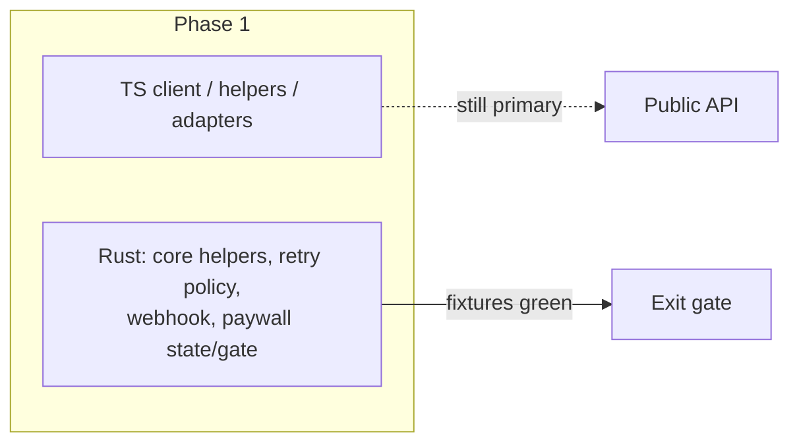

8. **Scaffold cargo workspace.** `solvapay-core` crate (no transport deps), CI build, Rust fixture runner reading Phase 0 fixture format.  
   **Done when:** CI builds and runs an empty fixture suite.

9. **Business details.** Translate [`business-details.ts`](../../packages/core/src/business-details.ts) and [`business-details-public.ts`](../../packages/core/src/business-details-public.ts).  
   **Done when:** their fixtures pass in Rust.

10. **Credit display + seller identity.** Translate [`credit-display.ts`](../../packages/core/src/credit-display.ts) and [`seller-identity.ts`](../../packages/core/src/seller-identity.ts).  
    **Done when:** their fixtures pass in Rust.

11. **Retry policy engine.** `withRetry` semantics; policy computation only (timers stay host-side).  
    **Done when:** step 5 fixtures pass in Rust.

12. **Webhook verification.** Parsing, tolerance, HMAC-SHA256, constant-time compare — one implementation replacing the Node-sync/edge-async split.  
    **Done when:** step 4 fixtures pass in Rust.

13. **Paywall state.** Translate `classifyPaywallState`, `buildGateMessage`, `buildNudgeMessage` from [`paywall-state.ts`](../../packages/server/src/paywall-state.ts).  
    **Done when:** their fixtures pass in Rust.

14. **Paywall gate.** Translate `buildPaywallGate` from [`paywall-gate.ts`](../../packages/server/src/paywall-gate.ts).  
    **Done when:** its fixtures pass in Rust byte-for-byte.

---

### Phase 2 — Generated DTOs and error model

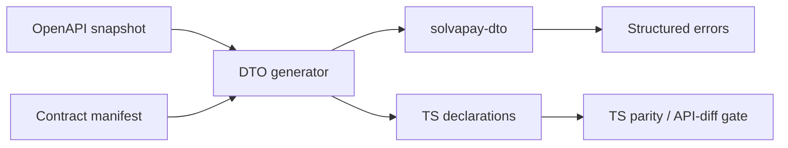

15. **Rust DTO generator.** From the OpenAPI snapshot (replacing hand-maintained shapes in [`types/generated.ts`](../../packages/server/src/types/generated.ts)).  
    **Done when:** generated crate compiles and round-trips the step 7 fixtures.

16. **SDK-only overlays.** Encode overlays from [`types/client.ts`](../../packages/server/src/types/client.ts) in the contract manifest and generator.  
    **Done when:** overlay types generate and compile.

17. **Error model.** Translate `SolvaPayError` / `PaywallError` into the structured cross-language error model.  
    **Done when:** error fixtures round-trip with stable codes.

18. **TS declarations + parity check.** Generate from the manifest; add API-diff check and manifest-driven per-language parity/coverage check.  
    **Done when:** generated declarations are drop-in compatible with current exports (diff empty) and the parity check passes for TypeScript.

---

### Phase 3 — HTTP client core

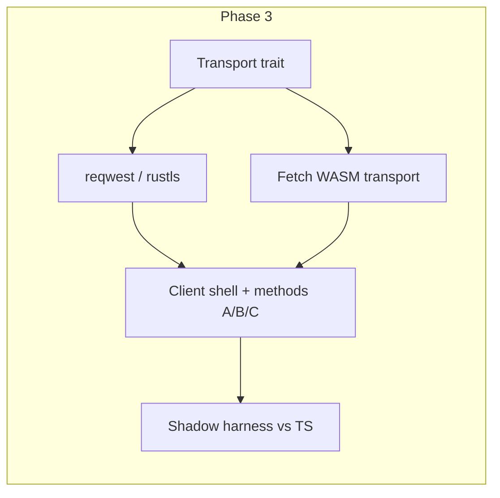

19. **Native transport.** Define the transport trait; implement `reqwest`/rustls.  
    **Done when:** a recorded-fixture mock server round-trips through it.

20. **WASM Fetch transport.** Same trait.  
    **Done when:** the same round-trip passes under `wasm32`.

21. **Client shell.** Auth headers, request construction, idempotency keys, retry wiring on the transport trait.  
    **Done when:** shell-level fixtures pass on both transports.

22. **Client methods group A.** Customer, session, and auth-adjacent methods from [`client.ts`](../../packages/server/src/client.ts).  
    **Done when:** their step 7 fixtures pass in Rust.

23. **Client methods group B.** Payment intents, top-ups, checkout.  
    **Done when:** their fixtures pass.

24. **Client methods group C.** Purchases, activation, usage, limits, plans, merchant, product, auto-recharge.  
    **Done when:** their fixtures pass; every `SolvaPayClient` method is covered.

25. **Shadow-mode harness.** TS and Rust clients side by side against live backend contract tests.  
    **Done when:** results are identical across the suite.

---

### Phase 4 — Route helper cores

Each step: translate, then pass the existing `*.test.ts` against the binding.

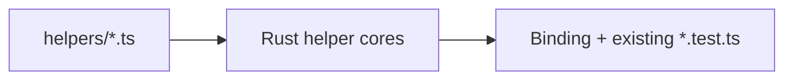

26. [`customer.ts`](../../packages/server/src/helpers/customer.ts), [`auth.ts`](../../packages/server/src/helpers/auth.ts), [`activation.ts`](../../packages/server/src/helpers/activation.ts).  
    **Done when:** existing helper tests pass against the binding.

27. [`payment.ts`](../../packages/server/src/helpers/payment.ts), [`payment-method.ts`](../../packages/server/src/helpers/payment-method.ts), [`checkout.ts`](../../packages/server/src/helpers/checkout.ts).  
    **Done when:** existing helper tests pass against the binding.

28. [`auto-recharge.ts`](../../packages/server/src/helpers/auto-recharge.ts), [`balance-poll.ts`](../../packages/server/src/helpers/balance-poll.ts) (delay schedules as policy; timers host-side).  
    **Done when:** existing helper tests pass against the binding.

29. [`purchase.ts`](../../packages/server/src/helpers/purchase.ts), [`renewal.ts`](../../packages/server/src/helpers/renewal.ts).  
    **Done when:** existing helper tests pass against the binding.

30. [`usage.ts`](../../packages/server/src/helpers/usage.ts), [`limits.ts`](../../packages/server/src/helpers/limits.ts), [`plans.ts`](../../packages/server/src/helpers/plans.ts).  
    **Done when:** existing helper tests pass against the binding.

31. [`merchant.ts`](../../packages/server/src/helpers/merchant.ts), [`product.ts`](../../packages/server/src/helpers/product.ts), [`error.ts`](../../packages/server/src/helpers/error.ts).  
    **Done when:** existing helper tests pass against the binding.

---

### Phase 5 — Paywall decision engine and MCP contracts

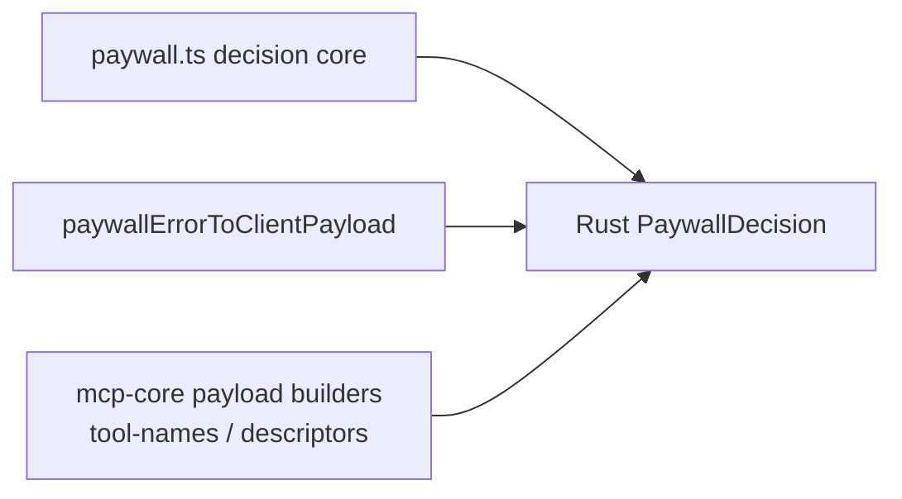

32. **Paywall decision core.** Limit evaluation and `PaywallDecision` production from [`paywall.ts`](../../packages/server/src/paywall.ts) (handler/context plumbing stays TS).  
    **Done when:** decision fixtures pass.

33. **Client payload shapes.** `paywallErrorToClientPayload` and related shapes.  
    **Done when:** payload fixtures pass.

34. **MCP payload builders.** Pure builders from [`packages/mcp-core`](../../packages/mcp-core): `paywallToolResult`, `response-envelope`.  
    **Done when:** `@solvapay/server` and `@solvapay/mcp-core` produce identical payloads from shared fixtures.

35. **MCP descriptors.** `tool-names` and `descriptors` from [`packages/mcp-core`](../../packages/mcp-core).  
    **Done when:** descriptor fixtures pass.

---

### Phase 6 — Node binding cutover, then edge/browser WASM

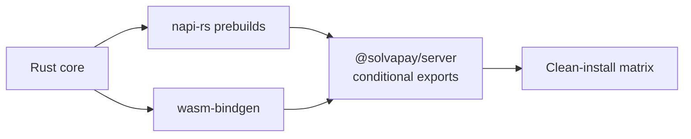

36. **Scaffold napi-rs.** Binding package with prebuilds for the platform matrix.  
    **Done when:** `require` works on every matrix target in CI.

37. **Wire conditional exports.** `@solvapay/server` → napi-rs with WASM fallback, behind a version flag.  
    **Done when:** existing server test suite is green on the binding.

38. **Edge/browser WASM cutover.** Cut `edge.ts` consumers over to the WASM build.  
    **Done when:** edge export tests pass and WASM size/cold-start budgets are met.

39. **Clean-install smoke tests.** Across the platform matrix as a permanent CI gate.  
    **Done when:** the gate runs green on main.

---

### Phase 7 — Python

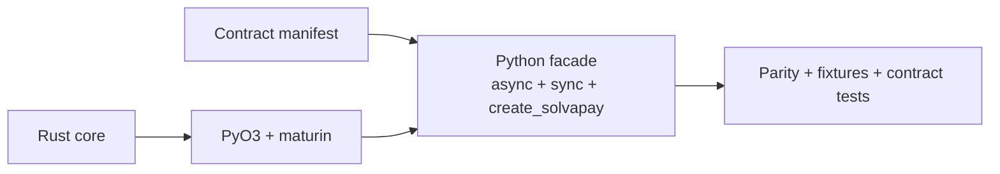

40. **Scaffold PyO3/maturin.** Tokio runtime and GIL-release plumbing.  
    **Done when:** wheels build for the target matrix and a hello-world call round-trips.

41. **Generate Python facade.** Async plus blocking sync from the contract manifest, including the full portable surface and an idiomatic `create_solvapay` / paywall-gate equivalent (e.g. a decorator) driven by the shared decision core.  
    **Done when:** shared fixture conformance passes and the per-language parity check confirms every catalogued public entry point is present with matching semantics.

42. **Live contract tests + publish.**  
    **Done when:** contract tests green and wheel installs cleanly.

---

### Phase 8 — Ruby

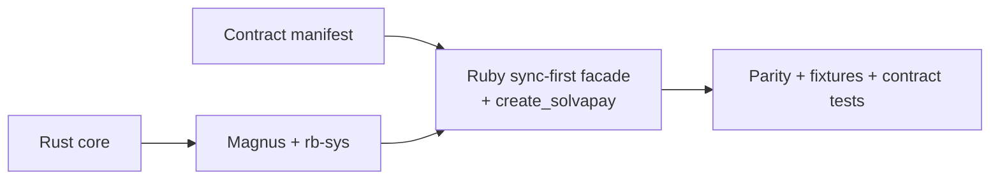

43. **Scaffold Magnus/rb-sys.** GVL-release plumbing.  
    **Done when:** platform gems build and a hello-world call round-trips.

44. **Generate Ruby facade.** Sync-first from the contract manifest, including the full portable surface and an idiomatic `create_solvapay` / paywall-gate equivalent (e.g. a block/wrapper method) driven by the shared decision core.  
    **Done when:** shared fixture conformance passes and the per-language parity check confirms every catalogued public entry point is present with matching semantics.

45. **Live contract tests + publish.**  
    **Done when:** contract tests green and gem installs cleanly.

---

### After cutover — deletion and C ABI

46. **Delete superseded TS in `@solvapay/core`.** Keep the facade.  
    **Done when:** package tests green with Rust-only logic.

47. **Delete superseded TS in `@solvapay/server`.** Utils, webhook, paywall-state/gate, client internals, helpers; keep facades and adapters.  
    **Done when:** server suite green.

48. **Publish optional C ABI.** Headers via cbindgen, opaque handles, free functions.  
    **Done when:** header compiles in a C smoke test.

49. **Promote all compatibility gates.** API diff, cross-surface parity/coverage, fixture conformance, size budgets, fuzzing — required CI checks.  
    **Done when:** all gates required on main.

---

## 9. Migration and verification roadmap

### 9.1 Migration principles

- Follow the step-by-step path in §8.
- Preserve existing npm package names and React imports throughout.
- Ship each phase behind the existing TypeScript surface (no public API changes) until Python/Ruby publish intentionally adds new packages.
- Exit gate of each phase must be green before the next phase begins.

### 9.2 Rollback boundaries

| Surface                                | Rollback strategy                                                     |
| -------------------------------------- | --------------------------------------------------------------------- |
| `@solvapay/server` conditional exports | Feature/version flag to force previous TS or WASM path                |
| `verifyWebhook` Node-sync / edge-async | Keep thin facades; core swap is internal                              |
| Fetch-runtime validation               | Adapter tests remain TS; can point helpers back to TS during rollback |
| Deno / Workers                         | WASM build pin; reject broken WASM via size/cold-start gate           |
| React behavior                         | Unmodified React tests; never bind React to native directly           |

### 9.3 CI gates

| Gate                                    | Purpose                                                                    |
| --------------------------------------- | -------------------------------------------------------------------------- |
| Generated-diff checks                   | OpenAPI snapshot + generated DTOs/declarations stay in sync                |
| ABI/API compatibility                   | No silent public API drift on TS exports                                   |
| Per-language public-API parity/coverage | Every wrapper exposes every catalogued entry point with matching semantics |
| Shared fixture conformance              | All bindings + all three language wrappers                                 |
| Live backend contract tests             | Shadow mode (Phase 3) and language-specific (Phases 7–8)                   |
| Clean-install smoke tests               | Platform matrix                                                            |
| Platform build matrices                 | napi-rs / wheels / gems / WASM                                             |
| Fuzzing                                 | FFI parsers and opaque-handle misuse                                       |
| Performance regression thresholds       | WASM size, cold start, request overhead budgets                            |

### 9.4 Testing strategy summary

- Phase 0 fixtures are the behavioral golden set.
- Rust fixture runner (Phase 1+) reuses the same JSON format.
- Existing `*.test.ts` helper tests become binding conformance tests in Phase 4.
- React package tests run unmodified at every cutover step.
- Shadow mode (step 25) is the live-backend identity check before Node cutover.

---

## 10. Sequence diagrams (subtle flows)

### 10.1 Client request with retries

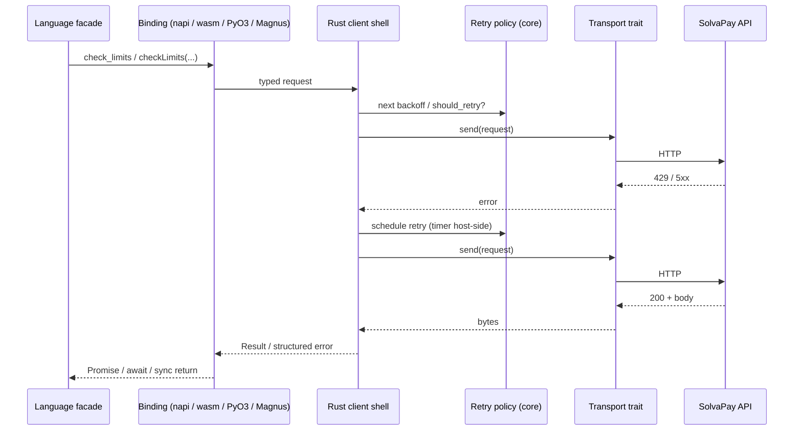

### 10.2 Webhook verification

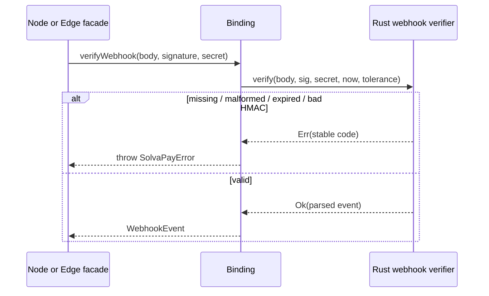

### 10.3 Paywall decision path

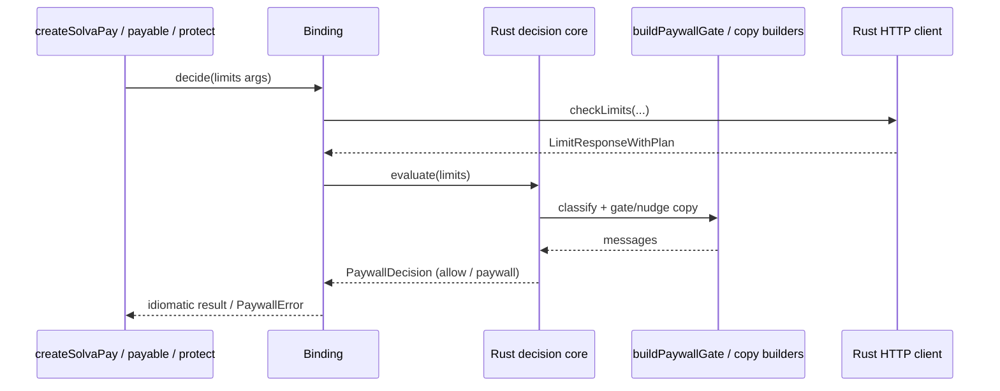

### 10.4 Shadow-mode comparison

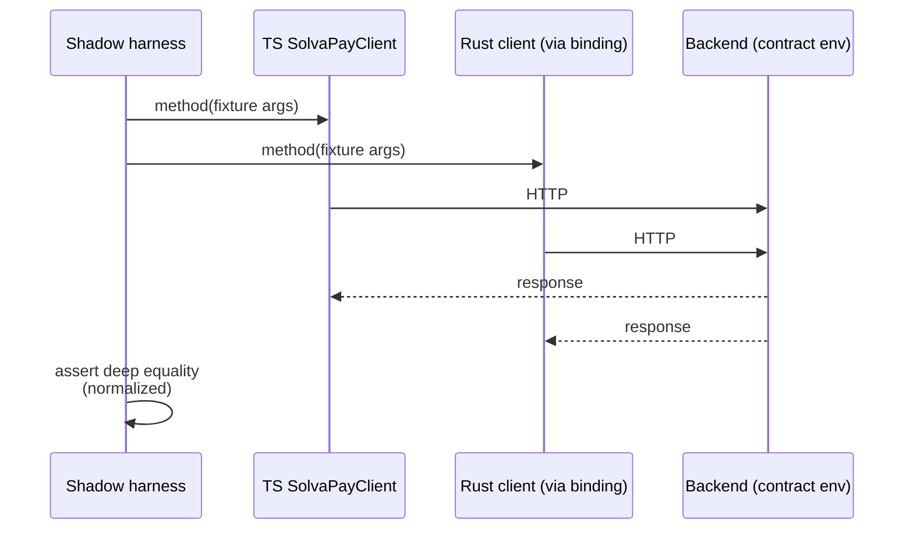

---

## 11. Explicit decisions

| ID  | Decision                                                                                        |
| --- | ----------------------------------------------------------------------------------------------- |
| D1  | Specialized bindings (napi-rs, wasm-bindgen, PyO3, Magnus); optional C ABI for third parties    |
| D2  | Cross-surface API parity is a CI-enforced success criterion                                     |
| D3  | std-based core with size discipline; not `no_std`                                               |
| D4  | Async Rust concurrency; runtime-agnostic core; bindings own event loops                         |
| D5  | Checked-in filtered OpenAPI snapshot + SDK contract manifest as dual generation inputs          |
| D6  | React, framework adapters, factory ergonomics, auth/next/cli stay TypeScript                    |
| D7  | Migration is 49 session-sized steps with per-step “done when” gates                             |
| D8  | This document is living: research findings and diagram updates land in the same session as code |

---

## 12. Unresolved implementation gates

These are intentionally open until the phase that needs them; resolve with research + a PR that updates this section.

| Gate                                                                         | Resolve by                                              |
| ---------------------------------------------------------------------------- | ------------------------------------------------------- |
| Exact WASM size and cold-start numeric budgets                               | Step 38 baseline                                        |
| Final npm optional-dependencies / optional native package layout             | Step 36–37                                              |
| Python package name on PyPI (`solvapay` vs scoped)                           | Step 40–42                                              |
| Ruby gem name and versioning scheme                                          | Step 43–45                                              |
| Whether UniFFI is ever used for a _fourth_ language later                    | Only if a new language cannot use a specialized binding |
| Process-payment OpenAPI discriminator fix ownership (backend vs SDK overlay) | Before step 15 cutover                                  |
| Fuzz corpus seed strategy for webhook/FFI parsers                            | Step 49                                                 |

---

## 13. Authoritative research links

Re-check these at the start of any step that touches the corresponding layer; pin versions in Cargo/npm when adopting.

| Topic                             | Links                                                                                                                                                                                      |
| --------------------------------- | ------------------------------------------------------------------------------------------------------------------------------------------------------------------------------------------ |
| UniFFI                            | [mozilla/uniffi-rs](https://github.com/mozilla/uniffi-rs), [docs.rs/uniffi](https://docs.rs/uniffi)                                                                                        |
| Diplomat                          | [rust-diplomat/diplomat](https://github.com/rust-diplomat/diplomat), [Diplomat blog (2026)](https://manishearth.github.io/blog/2026/06/14/diplomat-multi-language-ffi-for-rust-libraries/) |
| cbindgen                          | [mozilla/cbindgen](https://github.com/mozilla/cbindgen)                                                                                                                                    |
| wasm-bindgen                      | [rustwasm/wasm-bindgen](https://rustwasm.github.io/wasm-bindgen/), [wasm-pack](https://rustwasm.github.io/wasm-pack/)                                                                      |
| napi-rs                           | [napi.rs](https://napi.rs/), [napi-rs/napi-rs](https://github.com/napi-rs/napi-rs)                                                                                                         |
| PyO3 / maturin                    | [PyO3](https://pyo3.rs/), [maturin](https://www.maturin.rs/), [Bindings guide](https://www.maturin.rs/bindings)                                                                            |
| Magnus / rb-sys                   | [Magnus](https://github.com/matsadler/magnus), [rb-sys](https://github.com/oxidize-rb/rb-sys)                                                                                              |
| Rust FFI safety                   | [The Rustonomicon — FFI](https://doc.rust-lang.org/nomicon/ffi.html), [Unsafe Code Guidelines](https://rust-lang.github.io/unsafe-code-guidelines/)                                        |
| WebAssembly Component Model / WIT | [Component Model](https://component-model.bytecodealliance.org/), [WIT](https://component-model.bytecodealliance.org/design/wit.html)                                                      |
| reqwest / rustls                  | [reqwest](https://docs.rs/reqwest), [rustls](https://docs.rs/rustls)                                                                                                                       |
| Workers / WASM limits             | [Cloudflare Workers limits](https://developers.cloudflare.com/workers/platform/limits/), platform release notes as of the step date                                                        |

---

## 14. How to use this document in a session

1. Pick the next incomplete step in §8.
2. Run the research rule for that step’s toolchains; update §6 / §11 / §12 / §13 if needed.
3. Implement only that step’s scope.
4. Prove the “done when” check.
5. Update any Mermaid diagram this step changes.
6. Stop. Do not start the next step in the same session unless the sizing rule still holds (rare).

When Phase 0 begins, add a short “Research log” subsection under the phase with dated bullets; keep entries terse (what was checked, version, decision impact).
