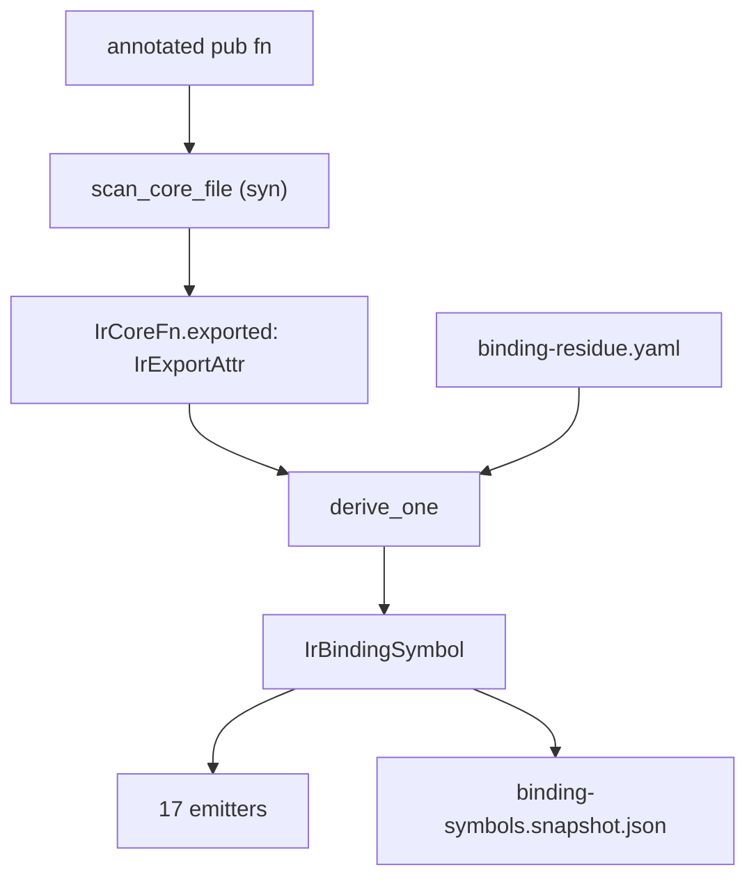

# The `#[solvapay_export]` attribute

Reference for the marker that puts a Rust function on the SDK boundary: what
each argument means, what you get by writing nothing, and where the attribute
stops and [`binding-residue.yaml`](../../contract/manifest/binding-residue.yaml)
starts.

Companion docs:

- Design and phase sequence: [`codegen-ast-derivation.md`](./codegen-ast-derivation.md)
- Day-to-day runbook: [`sdk-codegen.md`](./sdk-codegen.md)
- As-built crate map: [`architecture.md`](./architecture.md)

## 1. What it is

Rust has no stable user-definable inert attribute, so
[`core/solvapay-export`](../../core/solvapay-export/src/lib.rs) is a
proc-macro that returns `item` unchanged. The compiler ignores it entirely; it
exists so the attribute compiles. dto-gen reads the tokens separately, with
`syn`, from the source text.

The hard rule from `codegen-ast-derivation.md` holds: the attribute is
**explicit and per-item, never derived from `pub` visibility**. An accidental
export ships on six language surfaces.

Spelling differs by crate, and both forms are in-tree:

| Crate                | Call site                                | Why                                                                    |
| -------------------- | ---------------------------------------- | ---------------------------------------------------------------------- |
| `solvapay-core`      | `#[crate::solvapay_export(...)]`         | re-exported at [`lib.rs`](../../core/solvapay-core/src/lib.rs) line 56 |
| `solvapay-transport` | `#[solvapay_core::solvapay_export(...)]` | transport depends on core and reaches the re-export through it         |

The bare form `#[solvapay_export]` parses to all-defaults. Every in-tree call
site passes at least `catalog`.

## 2. How it flows



Two scoping facts, because both surprise people:

- **Only `pub fn` items and `pub` inherent-impl methods are read.**
  `parse_export_attr` is called from `scan_sig`, and nothing else calls
  `scan_sig`. The attribute on a struct or enum does nothing — boundary types
  are selected by transitive closure over the named types appearing on
  annotated signatures (plus `typed_as` values), never by annotating the type.
- **Generic functions, generic impls, trait impls, and `#[cfg(test)]` items are
  skipped by the scanner** before the attribute is ever parsed.

Scanning walks every `.rs` file under `--core-src` and `--transport-src`
recursively, so module layout does not matter; the module path is derived from
the file path.

## 3. Key reference

Sixteen keys, in four groups. Every value is a **string literal** except
`emit_order`, which is an **integer literal**.

### Identity

| Key            | Form   | Default                                                                   | Effect                                                                               |
| -------------- | ------ | ------------------------------------------------------------------------- | ------------------------------------------------------------------------------------ |
| `id`           | string | camelCase of the Rust fn name                                             | The canonical binding id: the residue key, the catalog link id, and the snapshot key |
| `rust_fn_name` | string | `{fn}_binding` for decisions / payloadBuilders; snake-case `id` otherwise | Name of the generated shim function                                                  |

`id` also drives the six per-language names. A `SCREAMING_SNAKE` id is passed
through unchanged on all six languages; any other id is camelCase for TS and C,
snake_case for Python, Ruby and Rust, and PascalCase for Go.

### Placement

| Key          | Form    | Default                                                                                   | Effect                                                                      |
| ------------ | ------- | ----------------------------------------------------------------------------------------- | --------------------------------------------------------------------------- |
| `artifact`   | string  | `client` for transport; else `webhook` when `envelope = "webhookThrow"`; else `decisions` | Which generated shim file the symbol lands in                               |
| `catalog`    | string  | `operation` for transport, else `none`                                                    | How the symbol links to the manifest catalog                                |
| `section`    | string  | none                                                                                      | Section banner comment, emitted when it changes between consecutive symbols |
| `emit_order` | integer | `0`                                                                                       | Primary sort key within an artifact; ties break on `id`                     |

### Call shape

| Key               | Form           | Default                                                        | Effect                                                                            |
| ----------------- | -------------- | -------------------------------------------------------------- | --------------------------------------------------------------------------------- |
| `sync`            | string         | `async` for an `async fn` or any transport method, else `sync` | Sync kind of the generated surface                                                |
| `envelope`        | string         | mirrors `sync`                                                 | Envelope mode; `webhookThrow` also flips the default `artifact` to `webhook`      |
| `dto_type`        | string         | none                                                           | Client DTO the shim parses the args JSON into                                     |
| `split_path_refs` | CSV of strings | empty                                                          | Ordered path-ref keys for templated client routes; non-empty forces `clientSplit` |

`split_path_refs` must be listed in **path order** — `"productRef,planRef"` for
`/v1/sdk/products/{productRef}/plans/{planRef}`.

### Per-argument

These are comma-separated maps of `name:Value`, except `host_injected` which is
a plain comma-separated list. Read [§6](#6-the-residue-boundary) before reaching
for any of them: a residue `args:` block makes the whole group inert.

| Key             | Form                            | Keyed by                | Effect                                                      |
| --------------- | ------------------------------- | ----------------------- | ----------------------------------------------------------- |
| `host_injected` | `name,name`                     | boundary arg name       | Marks args the host adapter supplies (a clock, usually)     |
| `rename`        | `rustParam:jsonKey`             | **Rust parameter name** | Sets the JSON arg key when camelCasing is not what you want |
| `local`         | `argName:localIdent`            | boundary arg name       | Local binding name inside the shim                          |
| `extract`       | `argName:extractKind`           | boundary arg name       | Overrides the extractor derived from `(type, required)`     |
| `typed_as`      | `argName:Type`                  | boundary arg name       | Type for a `requireTyped` / `optionalTyped` extract         |
| `typed_style`   | `argName:turbofish\|annotation` | boundary arg name       | How that type is written at the call site                   |

`rename` is the odd one out: it is looked up by the **Rust** parameter name,
because it is what produces the boundary arg name. Every other key is looked up
by the resulting boundary name, so a renamed arg must be referenced by its new
name.

### Legal value sets

| Key           | Accepted values                                                                                                                                                                                                                                             |
| ------------- | ----------------------------------------------------------------------------------------------------------------------------------------------------------------------------------------------------------------------------------------------------------- |
| `artifact`    | `decisions`, `payloadBuilders`, `client`, `webhook`                                                                                                                                                                                                         |
| `catalog`     | `none`, `operation`, `topLevel`, `coreHelper`, `facade`                                                                                                                                                                                                     |
| `sync`        | `sync`, `async`                                                                                                                                                                                                                                             |
| `envelope`    | `sync`, `async`, `webhookThrow`                                                                                                                                                                                                                             |
| `typed_style` | `turbofish`, `annotation`                                                                                                                                                                                                                                   |
| `extract`     | `requireString`, `optionalString`, `requireF64`, `optionalF64`, `requireI64`, `requireU32`, `optionalU16`, `optionalU32`, `optionalU64`, `requireBool`, `requireObject`, `requireArray`, `requireTyped`, `optionalTyped`, `optionalValue`, `rawValueOrNull` |

`facade` is legal but has no in-tree use.

## 4. Defaults — what you get by writing nothing

All of this comes from `derive_one` in
[`derive_bindings.rs`](../../tools/codegen/dto-gen/src/derive_bindings.rs).

| Field             | Derivation                                                                                                                                                                                                    |
| ----------------- | ------------------------------------------------------------------------------------------------------------------------------------------------------------------------------------------------------------- |
| `id`              | camelCase of the Rust fn name                                                                                                                                                                                 |
| `catalog`         | `operation` for transport, else `none`                                                                                                                                                                        |
| `artifact`        | `client` for transport; else `webhook` when the envelope is `webhookThrow`, else `decisions`                                                                                                                  |
| `sync`            | `async` when the fn is `async` or lives in transport, else `sync`                                                                                                                                             |
| `envelope`        | mirrors `sync`                                                                                                                                                                                                |
| `rust_fn_name`    | `{fn}_binding` for decisions / payloadBuilders; the snake-case language name of `id` for client / webhook                                                                                                     |
| `args`            | derived from the signature (params camelCased in source order); **empty** for transport, where client args come from `dto_type` / `split_path_refs`                                                           |
| `args[].typed_as` | the param's type name, when the param is a named struct or enum                                                                                                                                               |
| `args[].extract`  | `default_extract(boundary_ty, required)`, or `requireTyped` / `optionalTyped` when `typed_as` resolved                                                                                                        |
| `args[].local`    | the Rust param name, when it differs from the boundary name                                                                                                                                                   |
| `call.serialize`  | from the return type — `ValueBool`, `ValueString`, `ResultAsValue`, `OptionHelperErr` (an `Option<HelperErrorResult>`), else `ToValue`; for clients, `ClientSplit` / `ClientIgnore` (nullary) / `ClientAwait` |
| `call.args`       | one token per param, adjusted for refness and `Option` (`&customer_ref`, `email.as_deref()`, `now_ms`)                                                                                                        |
| `core_call`       | the Rust fn name, except on `webhook` (suppressed)                                                                                                                                                            |
| `doc`             | the first backtick-delimited route from the rustdoc first line for clients; empty for `webhook`; else ``Binding for `{id}`.``                                                                                 |

Boundary types collapse the signature: `String`/`&str` → `string`, `f64` →
`f64`, `i64` → `i64`, `bool` → `bool`, and **everything else** → `value`.
`Option<T>` yields the `?` variants for string and f64 and flips `required` off.

The corollary worth internalizing: for a plain sync core helper the whole
attribute reduces to `artifact`, `catalog`, `section`, `emit_order`.

## 5. Recipes

### Sync core decision helper — the common case

[`customer_ref.rs`](../../core/solvapay-core/src/customer_ref.rs) is the whole
pattern. Seven `Option<&str>` params and a `String` return; every arg, extract,
call token and serialize kind falls out of the signature.

```rust
#[crate::solvapay_export(
    artifact = "decisions",
    catalog = "none",
    section = "customer",
    emit_order = 31
)]
pub fn resolve_customer_ref(hook_ref: Option<&str> /* … */) -> String {
```

### Presentation / payload builder

[`tax_summary.rs`](../../core/solvapay-core/src/tax_summary.rs) uses
`artifact = "payloadBuilders"`, `catalog = "coreHelper"`, plus an explicit
`id = "REVERSE_CHARGE_NOTE"` because the public surface is a
`SCREAMING_SNAKE` constant rather than a function name.

### Public name diverges from the Rust name

The derived `rust_fn_name` for a core helper follows the **Rust fn name**, not
the `id` — so an `id` override alone leaves the shim named after the
implementation. Pin both when they diverge:

- [`paywall_payload.rs`](../../core/solvapay-core/src/paywall_payload.rs) —
  fn `paywall_client_payload`, `id = "paywallErrorToClientPayload"`,
  `rust_fn_name = "paywall_error_to_client_payload_binding"`.
- [`retry.rs`](../../core/solvapay-core/src/retry.rs) — method
  `RetryPolicy::next_delay`, `id = "retryNextDelayMs"`,
  `rust_fn_name = "retry_next_delay_ms"` (dropping the `_binding` suffix).

### Webhook

[`webhook.rs`](../../core/solvapay-core/src/webhook.rs) sets
`envelope = "webhookThrow"`, which alone would imply `artifact = "webhook"`; it
states the artifact anyway. `webhook` suppresses `core_call`, forces `ToValue`,
and derives an empty `doc`.

### Client route

[`client.rs`](../../core/solvapay-transport/src/client.rs) leans almost
entirely on the transport defaults — `artifact`, `sync`, `envelope` and
`catalog` all derive — so a route is `catalog`, `section`, `emit_order`, and
`dto_type`:

```rust
#[solvapay_core::solvapay_export(
    catalog = "operation",
    section = "Group A",
    emit_order = 0,
    dto_type = "CreateCustomerRequest"
)]
pub async fn create_customer(&self, params: CreateCustomerRequest) -> Result<CreateCustomerResult, SdkError>
```

Templated routes add `split_path_refs` in path order
(`split_path_refs = "productRef,planRef"` on `update_plan`). Nullary routes such
as `get_merchant` take the one-line form and derive `ClientIgnore`.

### Per-argument keys

`host_injected`, `extract`, `typed_style`, `typed_as`, `local` and `rename`
exist and are wired, but **every in-tree use of one is currently shadowed by a
residue `args:` block** and therefore has no effect on the emitted symbol. The
seven affected symbols are `buildCreateCustomerParams`,
`extractBackendCustomerRef`, `isErrorResult`, `normalizeCancelResponse`,
`normalizeReactivateResponse`, `paywallToolResult` and `verifyWebhook` — each
one carries the intent in the attribute and the effective value in residue. Two
consequences:

- Treat those attributes as documentation of intent, not as working precedent.
  `isErrorResult` is the clearest case: its `extract = "result:rawValueOrNull"`
  keys off `result`, which is not even the derived arg name (`value`), yet the
  symbol still gets `rawValueOrNull` — from residue.
- On a **new** symbol with no residue, the per-argument keys do work as
  documented. That is the direction to push: express the property on the
  attribute and leave residue out.

## 6. The residue boundary

`binding-residue.yaml` is merged in `derive_one`, keyed by canonical `id`.
Precedence is **not** uniform, and that asymmetry is the trap:

| Residue field                                       | Interaction with the attribute                                                                                                                               |
| --------------------------------------------------- | ------------------------------------------------------------------------------------------------------------------------------------------------------------ |
| `args:`                                             | **Replaces the derived arg list wholesale.** The attribute's `rename`, `local`, `extract`, `typed_as`, `typed_style` and `host_injected` are never consulted |
| `splitPathRefs:` / `dtoType:`                       | Override the attribute when non-empty (neither is used in-tree today)                                                                                        |
| `verbatimBody:` / `verbatimBodyWasm:`               | Force `call: Verbatim`, discarding the derived serialize kind and call tokens                                                                                |
| `omitCoreCall:`                                     | Drops `core_call`                                                                                                                                            |
| `callArgs:`                                         | Replaces the derived call-argument tokens                                                                                                                    |
| `tsWrapper:`, `doc:`, `docWasm:`, `clientCallArgs:` | Residue-only — there is no attribute form                                                                                                                    |

When a key has `args:` in residue, the residue arg's own `hostInjected`,
`extract`, `local`, `typedAs` and `typedStyle` are the only ones that reach the
symbol. `buildCreateCustomerParams` is the canonical illustration: the attribute
declares `host_injected = "nowMs"`, the residue arg declares
`hostInjected: true` on `nowMs`, and only the second one is doing any work.

The rule to work by: **put it in the attribute if it is a property of the
boundary; put it in residue only if it is shim-emission detail the AST cannot
supply.** dto-gen errors on a residue key with no matching exported symbol, so
the file cannot rot — but per `codegen-ast-derivation.md` the residue count must
not grow.

## 7. Gates and error messages

| Message                                                                                        | Cause                                                                                          | Fix                                                                   |
| ---------------------------------------------------------------------------------------------- | ---------------------------------------------------------------------------------------------- | --------------------------------------------------------------------- |
| `#[solvapay_export]: unknown key <k>`                                                          | Typo, or a field that only exists in residue                                                   | Check §3; move shim-emission detail to `binding-residue.yaml`         |
| `duplicate #[solvapay_export] on the same item`                                                | Two markers on one fn                                                                          | Merge them into one attribute                                         |
| `#[solvapay_export] <k> must be a string literal`                                              | Bare identifier or non-string value                                                            | Quote it                                                              |
| `#[solvapay_export] <k> must be an integer literal`                                            | `emit_order = "3"`                                                                             | Drop the quotes                                                       |
| `#[solvapay_export] <k>: expected name:Type, got "…"`                                          | A map key written without its `:`                                                              | Use `name:Value`, comma-separated                                     |
| `#[solvapay_export] does not take a name-value form`                                           | `#[solvapay_export = "…"]`                                                                     | Use the list form                                                     |
| `#[solvapay_export] <id>: unknown catalog "…"`                                                 | `catalog` value outside the legal set                                                          | See the value-set table in §3                                         |
| `bindings.<id>: unknown artifact "…"` / `unknown sync "…"` / `unknown envelope "…"`            | Same, for those three keys — note these carry the `bindings.` prefix, not `#[solvapay_export]` | See the value-set table in §3                                         |
| `bindings.<id>.args.<arg>: unknown extract "…"` / `unknown typedStyle "…"`                     | Same, for the two per-argument enums                                                           | See the value-set table in §3                                         |
| `duplicate derived binding id <id>`                                                            | Two fns camelCase to the same id                                                               | Give one an explicit `id`                                             |
| `binding-residue.yaml: orphan key <k> has no #[solvapay_export] symbol`                        | Residue outlived its export, or the export's `id` changed                                      | Delete the residue key, or realign the `id`                           |
| `Bindings: orphan catalog entry operation.<id> has no binding linker (add #[solvapay_export])` | A catalogued op with no export (from `pnpm manifest:check`)                                    | Annotate the transport method; `pnpm gen:bindings` prints suggestions |

The loop after annotating:

```bash
pnpm gen            # regenerate; review the binding-symbols.snapshot.json diff
pnpm manifest:check # catalog reconciliation
pnpm parity:check   # cross-language signature parity
```

`pnpm gen:check` is the authoritative drift gate; the reviewed
`contract/manifest/binding-symbols.snapshot.json` diff is what tells you whether
the attribute said what you meant.

## 8. Limits

`syn` is syntactic. Type aliases, generics and re-exports are invisible to the
scanner, and the `assert_boundary::<T>()` backstop from the hybrid design is not
built — see the risk section of
[`codegen-ast-derivation.md`](./codegen-ast-derivation.md#risks-and-open-questions).
Until it exists, a mis-read type surfaces only as a generated shim that fails to
compile, or as a reviewed `boundary-types.snapshot.json` diff.

The scanner also runs in skip-unsupported mode, so an annotated fn whose
signature it cannot map is **dropped silently** rather than failing the run. It
resurfaces as an orphan residue key or an orphan catalog entry — and if the
symbol has neither, not at all. Shapes that block an export:

| Shape                                                    | Scanner behavior                                                       |
| -------------------------------------------------------- | ---------------------------------------------------------------------- |
| Generic functions                                        | `generic functions are not scanned`                                    |
| Tuple structs reached as a boundary type                 | `tuple structs are not supported`                                      |
| Tuple enum variants                                      | `tuple enum variants are not supported`                                |
| Data-carrying enums without `#[serde(tag)]` / `untagged` | `data-carrying enum must be #[serde(tag = ...)] or #[serde(untagged)]` |
| `#[serde(flatten)]`                                      | `#[serde(flatten)] is not supported`                                   |
| Map keys that are not `String`                           | `<Map> key must be String`                                             |
| Types that are not a path, reference, slice or tuple     | `unsupported type syntax`                                              |
| Non-identifier parameter patterns                        | `unsupported parameter pattern`                                        |

If a new export needs one of these, reshape the signature at the boundary rather
than widening the scanner — the boundary is JSON on the far side either way.
