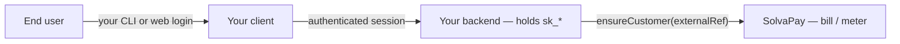

## Overview

SolvaPay bills and meters on the **server side**. Your product keeps its own client (CLI, web app, mobile) and its own identity provider (Auth0, Cognito, a custom IdP, or a provider CLI like `login` / `init`). Your backend holds `sk_*` and links each signed-in user to a SolvaPay customer via a stable **`externalRef`**.



This is the canonical integration shape when **you** own the customer experience. SolvaPay does not need a credential in the CLI, a SolvaPay-hosted approval page, or IdP access tokens on SolvaPay APIs.

## Quick start (any Node backend)

```typescript
import { createSolvaPay } from '@solvapay/server'

const solvaPay = createSolvaPay({
  apiKey: process.env.SOLVAPAY_SECRET_KEY,
})

// `externalRef` = your stable user id (Auth0 sub, Cognito sub, internal user id, etc.)
const externalRef = 'auth0|abc123'

const customerRef = await solvaPay.ensureCustomer(externalRef, externalRef, {
  email: 'user@example.com',
  name: 'Jane Doe',
})

// Use customerRef for limits, usage, and payments
await solvaPay.trackUsage({
  customerRef,
  productRef: 'prd_myapi',
  usageType: 'requests',
  amount: 1,
})
```

`ensureCustomer` is **idempotent**: repeated calls with the same `externalRef` return the same SolvaPay `customerRef`.

## The `externalRef` contract

| Rule | Detail |
| --- | --- |
| **Stable** | Use an identifier that does not change for the lifetime of the user (IdP `sub`, internal UUID, etc.). Do not use email alone. |
| **Deterministic** | The same user must always map to the same `externalRef`. |
| **IdP-agnostic** | Any string your backend controls is valid. Auth0 `sub` is a common choice, not a requirement. |
| **Provider-scoped** | `externalRef` is unique per SolvaPay provider (your account), not globally. |
| **Server-only linkage** | Call `ensureCustomer` from code that holds `sk_*`. Never send IdP access tokens to SolvaPay. |
| **Secret key stays server-side** | `sk_*` never belongs in a CLI, browser, or mobile app. |

### REST equivalent

The SDK wraps existing SDK customer endpoints:

- `GET /v1/sdk/customers?externalRef=` — find by linkage
- `POST /v1/sdk/customers` — create with `{ externalRef, email, name }`
- `PATCH /v1/sdk/customers/:reference` — update `externalRef` on an existing customer

`ensureCustomer` implements find-or-create-by-`externalRef` so you do not need to manage that flow yourself.

## Provider-owned CLI pattern

A provider that ships its own CLI (for example `your-cli login` backed by Auth0) already has an authenticated user id after login. The CLI talks to **your** API; your API calls SolvaPay:

1. CLI completes your IdP login and stores **your** session token (not `sk_*`).
2. CLI calls your backend with that session.
3. Backend resolves `externalRef` from the session (e.g. JWT `sub`).
4. Backend calls `ensureCustomer(externalRef)` then `trackUsage` / `payable` / `checkLimits`.

No SolvaPay device flow or hosted handoff is required.

See the runnable reference: [express-provider-linkage example](https://github.com/solvapay/solvapay-sdk/tree/main/examples/express-provider-linkage).

## Web app pattern (Auth0 reference)

For Next.js + Auth0, the SDK ships a ready reference that forwards `session.user.sub` as billing identity:

- Example: [examples/nextjs-auth0](https://github.com/solvapay/solvapay-sdk/tree/main/examples/nextjs-auth0)
- Scaffold: `npm create solvapay -- --type mcp --auth auth0` (or `--auth auth0` on the Next template)
- Adapter details: [Custom authentication adapters](./custom-auth)

The Auth0 path is **one** linkage implementation. The same `externalRef` contract applies with any IdP.

## Protecting routes after linkage

Once you have `customerRef`, pass it into paywall helpers:

```typescript
const payable = solvaPay.payable({ product: 'prd_myapi' })

// Express: set x-customer-ref after ensureCustomer in your auth middleware
app.post('/tasks', payable.http(createTask))
```

For Next.js, prefer `createAuth0AuthMiddleware` (or your own adapter) so route handlers receive `x-user-id` / `externalRef` automatically. For Express and other frameworks, resolve `externalRef` in middleware, call `ensureCustomer`, then set `x-customer-ref` for `payable.http()`.

## What not to do

- Do **not** put `SOLVAPAY_SECRET_KEY` in a customer CLI or browser.
- Do **not** send Auth0 (or other IdP) **access tokens** to SolvaPay APIs.
- Do **not** rely on email alone as `externalRef` — emails can change; subjects and internal ids should not.
- Do **not** assume SolvaPay will host your customer login — use [customer OAuth](/oauth) only when **your** OAuth clients need SolvaPay as the authorization server (e.g. MCP / third-party apps), which is separate from provider-owned CLI linkage.

## Related guides

- [Core concepts — customer references](/sdks/typescript/setup/core-concepts#customer-references)
- [Express integration](./express)
- [Custom authentication adapters](./custom-auth)
- [Examples gallery](./examples)
