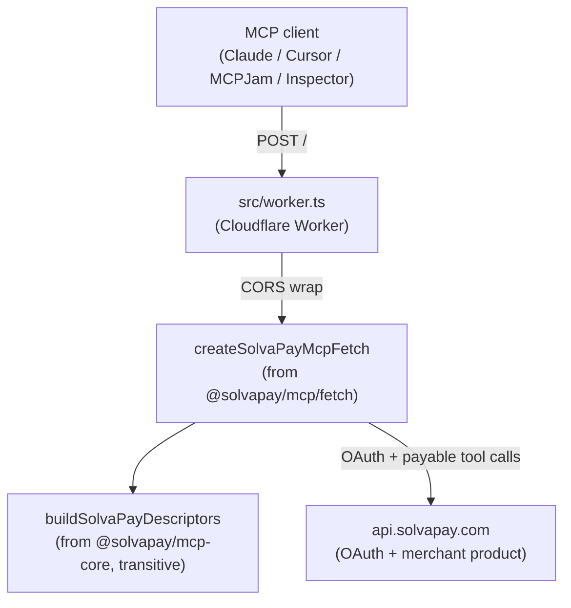

# Cloudflare Workers starter for SolvaPay MCP

A minimal fetch-first MCP server that runs on Cloudflare Workers, using the unified `@solvapay/mcp/fetch` factory. One adapter import, one factory call — the Workers isolate answers OAuth, tool calls, widget resource reads, and CSP metadata in a single `fetch` handler.

Ships with a toy paywalled demo toolbox (`predict_price_chart`, `predict_direction` — a seeded stock-predictor oracle) so you can see the full paywall + widget flow end-to-end before plugging in your own tools.

> **Sibling:** [`examples/supabase-edge-mcp/`](../supabase-edge-mcp/) is the same example on the Supabase Edge runtime. The worker entrypoint is the only meaningful difference between the two.

## What you get

- OAuth discovery (`/.well-known/oauth-authorization-server`, `/.well-known/oauth-protected-resource`, `/.well-known/openid-configuration`)
- Bridge routes (`/oauth/{register,authorize,token,revoke}`) backed by SolvaPay's hosted OAuth
- The SolvaPay MCP tool surface (`check_purchase`, `create_payment_intent`, `process_payment`, `upgrade`, `manage_account`, `topup`, …)
- A text-only paywall narration when a paywalled tool is called past the customer's plan limit, routing the LLM to the right recovery intent (`upgrade` / `topup` / `activate_plan`)
- The SolvaPay MCP widget iframe (`ui://cloudflare-workers-mcp/mcp-app.html`) with CSP auto-including your `apiBaseUrl`

## Prerequisites

- Node.js 20+ and pnpm 9.6+ (workspace-managed)
- A SolvaPay account with:
  - A secret key (`sk_…`)
  - A product ref (`prd_…`) — create one in the dashboard under **Products**
- A Cloudflare account with:
  - `wrangler` CLI authenticated (`npx wrangler login`)
  - A zone you control if you want a custom domain (this example's `wrangler.jsonc` targets `mcp-workers-example.solvapay.com` — change the `routes` entry to your own hostname, or drop it entirely and use the default `*.workers.dev` URL)

## Local dev

```bash
# From the monorepo root
pnpm install
pnpm -w build:packages

cd examples/cloudflare-workers-mcp
cp .env.example .env
# Fill in SOLVAPAY_SECRET_KEY, SOLVAPAY_PRODUCT_REF in .env

pnpm build            # Builds src/assets/mcp-app.html via vite
pnpm serve:local      # wrangler dev on http://localhost:8787
```

Then point an MCP client at `http://localhost:8787/`. Good candidates for a first smoke:

- **MCP Inspector** (`npx @modelcontextprotocol/inspector`) — reference client; gives you raw tool/resource call inspection.
- **MCPJam** — hosted web client with a chat UI.
- **Claude Desktop** — edit `claude_desktop_config.json` to add an HTTP MCP server entry.

## Troubleshooting

### `Invalid redirect_uri` during OAuth

Your MCP client is sending an authorization request with a cached `client_id` whose registered redirect URIs don't include the callback it's trying to use right now. The fix is to reset the client's OAuth state so it re-runs Dynamic Client Registration — the SDK's DCR endpoint will merge the new redirect URI onto the same provider-level client, and every subsequent request works.

- **MCP Inspector**: disconnect, open the **Auth** panel, and clear the saved OAuth state (or clear `localStorage` for `localhost:6274` in DevTools). Then upgrade to the latest: `npx @modelcontextprotocol/inspector@latest`. Versions before 0.17.3 had a [DCR bug](https://github.com/modelcontextprotocol/inspector/issues/930) where the registered redirect URI didn't match the one sent on `/authorize`.
- **Claude Desktop / MCPJam**: remove and re-add the server so the client drops its cached registration.

Note: SolvaPay's OAuth server accepts any port on loopback (`127.0.0.1`, `::1`, `localhost`) per RFC 8252, so once a loopback redirect URI is registered for your client, any Inspector port works without re-registering. Non-loopback hosts (MCPJam, Claude, custom domains) still require an exact match.

## Deploy

```bash
# From examples/cloudflare-workers-mcp/
pnpm build

# One-time: upload the merchant secret to the Worker
pnpm exec wrangler secret put SOLVAPAY_SECRET_KEY

# Copy .env.example -> .env and fill in your real values
# (product ref, canonical URL, optional staging API base).
cp .env.example .env
$EDITOR .env

# Edit wrangler.jsonc one-offs you want durable in git:
#   - `routes[].pattern`  — your hostname (or remove the routes block
#     entirely to serve on *.workers.dev)

pnpm run deploy
```

### Deploy the live demo

The same example also ships a prod target for the canonical
`goldberg-demo.solvapay.app` deploy, gated behind a separate Worker
name (`solvapay-mcp-goldberg-prod`) so its secrets and observability
are isolated from the public-safe example deploy above. The prod
config lives in the `[env.production]` block of `wrangler.jsonc`.

```bash
# One-time per prod Worker — secret is scoped to the env-block-named
# worker (solvapay-mcp-goldberg-prod), separate from the example
# Worker's secret store.
pnpm exec wrangler secret put SOLVAPAY_SECRET_KEY --env production

# Copy .env.prod.example -> .env.prod and fill in your live values
# (sk_live_…, live prd_…, canonical MCP_PUBLIC_BASE_URL).
cp .env.prod.example .env.prod
$EDITOR .env.prod

pnpm run deploy:prod   # builds + deploys to goldberg-demo.solvapay.app
```

`pnpm run deploy:prod` runs `node scripts/deploy.mjs --prod`, which
sources `.env.prod` instead of `.env` and passes `--env production`
to `wrangler deploy`. Everything else (the `--var` override
mechanism, secret separation) works the same way as the regular
deploy.

### How the deploy overrides work

`wrangler.jsonc` intentionally ships public-safe placeholder values
(`prd_your_product_ref`, `https://your-worker.example.com`, no
`SOLVAPAY_API_BASE_URL` override — src/worker.ts falls back to
`https://api.solvapay.com`). This means anyone who clones the repo
can run `pnpm run deploy` without accidentally connecting to someone
else's merchant or backend environment. The `[env.production]` block
ships its own placeholders for the same reason.

`pnpm run deploy` runs [`scripts/deploy.mjs`](./scripts/deploy.mjs),
which sources `.env` (gitignored) and passes your real values
through to `wrangler deploy --var KEY:VALUE` for:

- `SOLVAPAY_PRODUCT_REF`
- `MCP_PUBLIC_BASE_URL`
- `SOLVAPAY_API_BASE_URL` (optional)

`pnpm run deploy:prod` does the same thing but sources `.env.prod`
and adds `--env production` to the wrangler invocation, so the
overrides land on the prod Worker's vars instead of the example
Worker's.

Your `SOLVAPAY_SECRET_KEY` stays in `.env` (or `.env.prod`) for
`wrangler dev` but is *not* re-uploaded on every deploy — it lives
on the Worker as a proper Secret (via the one-time `wrangler secret
put` above; use `--env production` for the prod target) and persists
across deploys. Rotating it is a single `wrangler secret put` +
editing the dotenv file.

## File layout

```
examples/cloudflare-workers-mcp/
├── package.json              // deps: @solvapay/server, @solvapay/mcp; devDeps: wrangler, vite, typescript, …
├── wrangler.jsonc            // Workers config; routes, vars, Text rule for *.html, plus `[env.production]` for goldberg-demo.solvapay.app
├── tsconfig.json             // ES2022, Bundler, @cloudflare/workers-types
├── vite.config.ts            // Builds src/mcp-app.tsx -> dist/mcp-app.html (duplicated from supabase-edge-mcp)
├── mcp-app.html              // top-level HTML entry
├── .env.example              // dev/example deploy template
├── .env.prod.example         // goldberg-demo prod deploy template
├── .gitignore
└── src/
    ├── worker.ts             // ~60-line entrypoint: createSolvaPayMcpFetch + CORS mirror
    ├── demo-tools.ts         // paywalled demo tools (stock-predictor oracle)
    ├── mcp-app.tsx           // widget entry
    └── assets/
        └── mcp-app.html      // Vite build output (gitignored); imported as text at build
```

## How it wires together



The whole integration surface is:

```ts
import { createSolvaPay } from '@solvapay/server'
import { createSolvaPayMcpFetch } from '@solvapay/mcp/fetch'

const handler = createSolvaPayMcpFetch({
  solvaPay: createSolvaPay({ apiKey, apiBaseUrl }),
  productRef,
  resourceUri: 'ui://cloudflare-workers-mcp/mcp-app.html',
  readHtml: async () => mcpAppHtml,
  publicBaseUrl,
  apiBaseUrl,
  mode: 'json-stateless',
  hideToolsByAudience: ['ui'],
  additionalTools: registerDemoTools,
})
```

`mode: 'json-stateless'` is required for Workers (isolates don't pin across requests, so sessions can't persist in memory). `hideToolsByAudience: ['ui']` drops UI-only virtual tools (`create_checkout_session`, `process_payment`, …) from `tools/list` so text-only hosts don't reason about transport tools meant for the embedded iframe.

## Swapping in your own tools

The demo tools live entirely in `src/demo-tools.ts` and are not part of any `@solvapay/*` package. Replace the body of `registerDemoTools` with your own `registerPayable(...)` calls, or gate them off entirely by setting `DEMO_TOOLS=false` in `wrangler.jsonc` or `.env`.

## Widget source sync

The widget iframe payload (`mcp-app.html`, `src/mcp-app.tsx`, `vite.config.ts`) is byte-for-byte copied from [`examples/supabase-edge-mcp/`](../supabase-edge-mcp/). If you change the widget, apply the same edit to both examples until we extract a shared package. A TODO in both READMEs tracks this.

## Known limits

- Bundle size: the Workers free tier caps at 1MB post-gzip. `@modelcontextprotocol/sdk` + `@solvapay/mcp` + `@solvapay/server` sit close to that ceiling. On the paid tier (10MB), there's plenty of headroom.
- Cold start: expect ~50-150ms on the first request per isolate. Warm requests are sub-20ms. Measure for your own geography before committing.

## Upstream

This example lives in the [SolvaPay SDK monorepo](https://github.com/solvapay/solvapay-sdk). File issues, PRs, and `@preview` feedback there. The SDK surfaces it relies on are:

- [`@solvapay/server`](../../packages/server/README.md) — merchant client + paywall runtime
- [`@solvapay/mcp`](../../packages/mcp/README.md) — MCP toolbox; imported at the `./fetch` subpath
- [`@solvapay/mcp-core`](../../packages/mcp-core/README.md) — framework-neutral descriptor builder (transitive; rarely imported directly)
