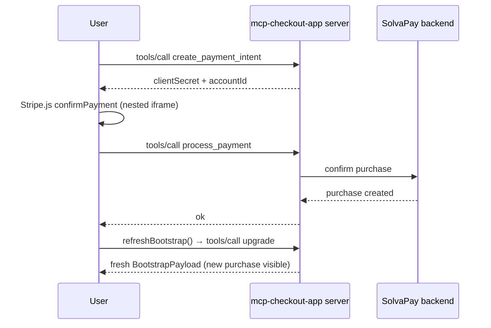
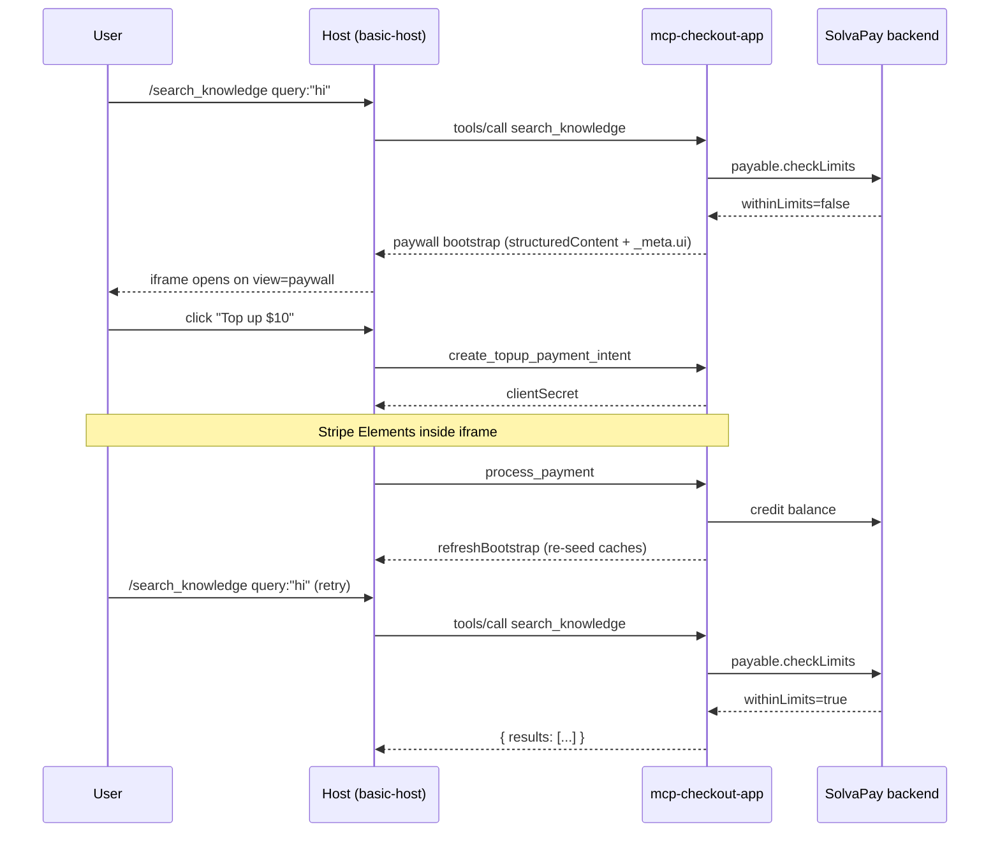

# MCP checkout app example

An MCP App that runs a **hybrid checkout** inside an MCP host's sandboxed
UI resource. On compliant hosts (hosts that honour the
[MCP Apps spec](https://modelcontextprotocol.io/docs/spec/app)'s
`_meta.ui.csp` extension, e.g. `basic-host`, ChatGPT) the UI mounts
Stripe Elements inline via the SolvaPay SDK's `<PaymentForm>` compound
primitive. On non-compliant hosts (today: Claude, which hardcodes
`frame-src 'self' blob: data:` and ignores `frameDomains`) the UI
detects the block via a runtime probe and falls back to launching
**SolvaPay hosted checkout** in a new browser tab.

## Choosing the right example

Three MCP examples ship in this repo. Start here if your product has a
full self-serve surface (plans, credit balance, top-up, usage); hop to
a sibling if you need less:

| Example | What it shows | Use when |
| --- | --- | --- |
| `examples/mcp-checkout-app` | Full 5-intent UI shell + embedded Stripe + paywalled demo data tools | You want the complete story — plan picker, checkout, top-up, usage meter, paywall |
| `examples/mcp-oauth-bridge` | Paywall-only, no UI, virtual tools only | You just need to gate a text-only tool behind SolvaPay usage limits |
| `examples/mcp-time-app` | Virtual tools + minimal UI, showcases the gate response | You want the smallest possible paywalled MCP server |

The MCP server holds `SOLVAPAY_SECRET_KEY` and exposes the trimmed
12-tool surface: 5 intent tools (`upgrade`, `manage_account`, `topup`,
`check_usage`, `activate_plan`) plus 7 UI-only state-change tools
(`create_checkout_session`, `create_customer_session`,
`create_payment_intent`, `process_payment`,
`create_topup_payment_intent`, `cancel_renewal`, `reactivate_renewal`).
Product-scoped data (merchant, product, plans) and the customer
snapshot (purchase, payment method, balance, usage) ride on the
`BootstrapPayload` every intent tool returns, so the embedded form
never fires per-view read calls.

Earlier iterations gave up on the embedded path because older host
versions blocked `js.stripe.com` unconditionally — see
[`solvapay-sdk/.cursor/plans/mcp-checkout-app_hosted-button-pivot_b3d9c1a2.plan.md`](../../.cursor/plans/mcp-checkout-app_hosted-button-pivot_b3d9c1a2.plan.md)
for the original rationale. The spec's new `_meta.ui.csp` extension
makes that path viable again on hosts that implement it, and the
runtime probe keeps us safe on hosts that don't.

## Prerequisites

1. SolvaPay backend running (defaults to `http://localhost:3001`; port 3000 is the Next.js frontend)
2. A product with at least one active plan
3. `SOLVAPAY_SECRET_KEY` scoped to that product
4. An MCP host such as [`basic-host`](https://github.com/modelcontextprotocol/basic-host)
   running at `http://localhost:8080`

## Configure

```bash
cp .env.example .env
# Fill in SOLVAPAY_SECRET_KEY and SOLVAPAY_PRODUCT_REF. The Stripe
# publishable key used for embedded Elements is fetched from the
# SolvaPay backend at boot (GET /sdk/platform-config) — no local
# config needed.
```

## Run

```bash
pnpm install
pnpm --filter @example/mcp-checkout-app build
pnpm --filter @example/mcp-checkout-app serve
```

Watch mode (rebuilds the UI bundle and restarts the server on changes):

```bash
pnpm --filter @example/mcp-checkout-app dev
```

Point `basic-host` at `http://localhost:3006/mcp` and open the app from
its tool list. On `basic-host` and ChatGPT the iframe renders inline
Stripe Elements; enter the test card `4242 4242 4242 4242` and pay
without leaving the host. On Claude the probe detects that
`js.stripe.com` cannot iframe and the UI falls back to an **Upgrade**
button that opens hosted checkout in a new tab — returning to the host
fires `refreshBootstrap()` (which calls `manage_account` under the
hood) and flips the card to **Manage purchase**.

## Flow

```mermaid
sequenceDiagram
  participant U as User
  participant H as Host (basic-host)
  participant S as mcp-checkout-app server
  participant SP as SolvaPay backend

  U->>H: Select MCP App tool
  H->>S: tools/call upgrade (intent tool)
  S->>SP: parallel fetch merchant / product / plans / customer
  SP-->>S: snapshots
  S-->>H: BootstrapPayload (structuredContent) + UI resource URI
  H->>S: resources/read ui://mcp-checkout-app/mcp-app.html
  S-->>H: HTML + _meta.ui.csp
  H-->>U: iframe mounts
  U->>H: (React McpApp renders — provider seeded, probe runs)
  Note over U,H: Tab nav is local state; no further tool call on switch
```

Mutation path — e.g. user pays inside the iframe:



1. Host loads `ui://mcp-checkout-app/mcp-app.html`. The resource
   registration declares `_meta.ui.csp` with Stripe's required
   `resourceDomains` / `connectDomains` / `frameDomains` — hosts that
   implement the spec propagate these to the iframe's CSP.
2. The bundle renders `<McpApp app={app} />` from
   [`@solvapay/react/mcp`](../../packages/react/src/mcp). `McpApp` runs
   `app.connect()`, calls the matching intent tool (`upgrade`,
   `manage_account`, `topup`, `check_usage`, or `activate_plan`), seeds
   the provider's module caches via `seedMcpCaches(initial, config)`,
   and mounts `<SolvaPayProvider config={{ transport, initial }}>` so
   every hook reads from the snapshot without a first-mount fetch.
   `transport = createMcpAppAdapter(app)` only tunnels the 7 UI-only
   state-change tools — read tools (`check_purchase`, `get_merchant`,
   etc.) no longer exist; their data arrives on the `BootstrapPayload`.
3. On mount the UI calls `upgrade`. The intent tool parallel-loads
   merchant, product, plans, and (when authenticated) the full
   customer snapshot, plus SolvaPay's platform Stripe pk from
   `GET /sdk/platform-config`. A `useStripeProbe` hook races
   `loadStripe(publishableKey)` against a 3 s timeout to classify the
   host as `'ready'` (embedded), `'blocked'` (fallback) or `'loading'`
   (spinner). If `/sdk/platform-config` is unreachable or the key is
   unconfigured the tool returns `null` and the hosted fallback
   renders.
4. **Embedded branch (`probe === 'ready'`):** renders the SDK's
   `<PaymentForm.Root>` compound (`Summary` / `PaymentElement` /
   `Error` / `MandateText` / `SubmitButton`). Card entry happens in a
   nested `js.stripe.com` iframe; confirmation goes through
   `create_payment_intent` → Stripe.js `confirmPayment` →
   `process_payment`. Post-purchase the shell calls
   `refreshBootstrap()` and the card switches to `<CurrentPlanCard>`.
5. **Hosted branch (`probe === 'blocked'`):** the original hosted-button
   experience — `create_checkout_session` populates an
   `<a target="_blank">` anchor, the user completes payment in a new
   tab, and `focus`/`visibilitychange` listeners fire
   `refreshBootstrap()` to flip to **Manage purchase**.

## Tools

**Intent tools (LLM-callable, dual-audience):**

| Tool | Purpose |
| --- | --- |
| `upgrade` | Returns the `BootstrapPayload` (merchant, product, plans, customer snapshot, stripePublishableKey) so the UI can probe Stripe Elements and render the checkout view |
| `manage_account` | Returns the bootstrap for the account dashboard (current plan, balance, payment method, cancel/reactivate controls, portal launcher) |
| `topup` | Returns the bootstrap for the top-up flow |
| `check_usage` | Returns the bootstrap for the usage dashboard (used / remaining / reset date) |
| `activate_plan` | With `planRef`: activates a free/usage-based plan or returns a checkout URL for paid plans. Without `planRef`: returns the picker bootstrap |

**UI-only state-change tools (tagged `_meta.audience: 'ui'`):**

| Tool | Purpose |
| --- | --- |
| `create_checkout_session` | Returns `{ sessionId, checkoutUrl }` for the SolvaPay hosted checkout (used by the fallback branch) |
| `create_customer_session` | Returns `{ sessionId, customerUrl }` for the SolvaPay customer portal |
| `create_payment_intent` | Creates the PaymentIntent consumed by the embedded branch's `<PaymentForm>` |
| `process_payment` | Records the Stripe-side confirmation after `confirmPayment` resolves |
| `create_topup_payment_intent` | Creates the PaymentIntent consumed by the top-up flow |
| `cancel_renewal` | Cancels auto-renewal on an active purchase |
| `reactivate_renewal` | Undoes a pending cancellation |

`returnUrl` on `create_checkout_session` is intentionally unset — there
is no meaningful URL to return to inside an MCP host iframe, so the
SolvaPay backend default is used.

### A note on `stripePublishableKey`

The publishable key every intent tool returns is **SolvaPay's platform
key**, sourced from the SolvaPay backend via `GET /sdk/platform-config`
(resolved sandbox/live against the authenticated provider's
environment). It is not the connected merchant's own pk. SolvaPay uses
Stripe Connect direct charges, so the browser-side pattern everywhere
in the SDK is `loadStripe(platformPk, { stripeAccount: connectedAccountId })`
— the merchant's own publishable key is never touched.

The key is forwarded on `BootstrapPayload.stripePublishableKey` purely
so `useStripeProbe` has a syntactically valid pk to pass to
`loadStripe()` when testing whether the host's CSP `frameDomains` lets
`js.stripe.com` mount. The real payment flow re-fetches the same pk
(plus the `accountId` the probe never sees) from
`create_payment_intent`, so the probe value is never fed into
`confirmPayment`. If the backend doesn't have a platform pk
configured for the provider's environment, or the
`/sdk/platform-config` call fails for any reason, the payload carries
`null` and every host falls back to the hosted-button branch.

## Trying the paywall

The example registers three paywalled demo data tools
([`src/demo-tools.ts`](src/demo-tools.ts)) so you can click through the full
story — call a business tool → hit the gate → resolve in the iframe →
retry — without hand-rolling a gated tool.

| Tool | Purpose |
| --- | --- |
| `search_knowledge` | Returns 3 deterministic stub snippets for a query. Wrapped with `solvaPay.payable().mcp()` so each call consumes 1 credit. |
| `get_market_quote` | Returns a deterministic fake price for a ticker. Same paywall semantics as `search_knowledge`. |
| `query_sales_trends` | Returns deterministic sales rows for a date range and attaches a **`low-balance` nudge** to the success response when the customer is running low on credits. Exercises the nudge branch of `ctx.respond()`. |

All three are gated behind the `DEMO_TOOLS` env var. Set `DEMO_TOOLS=false`
when you copy this example to your own repo — the demo tools and their
slash-command prompts (`/search_knowledge`, `/get_market_quote`,
`/query_sales_trends`) disappear and your copy becomes a clean template.

### `ctx.respond()` and upsell nudges

`query_sales_trends` shows the handler surface end-to-end:

```ts
handler: async ({ range }, ctx) => {
  const results = buildDeterministicRows(range)
  if (ctx.customer.balance < 1000) {
    return ctx.respond(
      { range, results },
      {
        units: results.length, // reserved for V1.1 — V1 ignores this
        nudge: { kind: 'low-balance', message: 'Running low on credits' },
      },
    )
  }
  return ctx.respond({ range, results }, { units: results.length })
}
```

- `ctx.customer` — cached snapshot of the pre-check `LimitResponseWithPlan`;
  values are ≤10s stale after mutations. Call `ctx.customer.fresh()`
  for a round-trip when freshness matters.
- `ctx.respond(data, options?)` — returns a branded envelope. V1
  supports `text` (content[0].text override) and `nudge` (inline
  upsell strip). Reserved: `units` (V1.1 variable-unit billing — V1
  silently ignores the field for forward-compatible handler code).
- `ctx.gate(reason?)` — sugar over `throw new PaywallError(reason)`
  when merchant-side rules need to force the paywall.
- Reserved stubs: `ctx.emit(block)` (V1 queues, V1.1 SSE emits),
  `ctx.progress(...)` / `ctx.progressRaw(...)` (V1 no-op), `ctx.signal`
  (V1 unaborted).

### Data-tool iframe entry — how paywall / nudge reach the widget

When a paywalled merchant tool (e.g. `search_knowledge`) returns a gate
or nudge response, `buildPayableHandler` stamps `_meta.ui.resourceUri`
and rewrites `structuredContent` with `view: 'paywall'` (gate) or
`view: 'nudge'` (strip) plus the full `BootstrapPayload`. The MCP host
(MCPJam, ChatGPT Apps, Claude Desktop) opens the iframe *from that
tool result* and forwards the payload to the mounted widget via
`ui/notifications/tool-result`. `<McpApp>` does **not** re-call the
merchant tool for bootstrap — doing so would consume another unit of
usage, and the `upgrade` intent fallback would return a checkout
payload that clobbers the gate / strip the user just saw.

Concretely, the widget's mount branches on `classifyHostEntry(app)`:

- **intent entry** (`toolInfo.tool.name ∈ { upgrade, manage_account,
  topup }`): call the matching intent tool via `fetchMcpBootstrap`.
  Same behaviour as before.
- **data entry** (merchant-registered tool, e.g. `search_knowledge`):
  wait up to 2s for the originating `ui/notifications/tool-result` and
  consume its `structuredContent` directly via
  `parseBootstrapFromToolResult`. No `callServerTool` round-trip. If
  the host fails to deliver the initial notification within the
  timeout, `<McpApp>` surfaces an `onInitError` naming the fix ("host
  must forward the originating tool result to the mounted iframe").
- **transport entry** (payments / sessions / renewal / activation):
  treated as unknown — rare but safe fallback to `upgrade`.

`McpAppShell` skips its mount-refresh when `bootstrap.view` is
`paywall` or `nudge` for the same reason: the gate / strip came from
an authoritative tool result and should not race a fresh `upgrade`
fetch. The refresh fires again the next time the customer commits an
action (plan select, topup confirmation, etc.).

Integrators who own their own widget mount on top of
`createMcpAppAdapter` can replicate this flow with
`waitForInitialToolResult(app, { timeoutMs })` — a one-shot helper
exported from `@solvapay/react/mcp` that subscribes, parses, and
unsubscribes.

### End-to-end recipe

1. Configure **three plans** on your product in the SolvaPay admin:
   **Free** (auto-active, ~50 calls / month quota), **Pay as you go**
   (`type: usage-based`, e.g. $0.01 / call), and a **Recurring** plan
   (e.g. $18 / month with included credits). The Free plan makes the
   paywall reachable by exhausting the free quota instead of by admin
   balance-zeroing; the two paid plans exercise the brief's PAYG and
   Recurring activation branches.
2. Start the example (`pnpm --filter @example/mcp-checkout-app dev`) and
   point `basic-host` at `http://localhost:3006/mcp`.
3. Customer is on Free by default. Call `/search_knowledge query: "hi"`
   N times; each call drains the free quota.
4. When the Free quota exhausts, the next call returns a **paywall gate**.
   The host opens the UI resource on `view: 'paywall'` — `McpPaywallView`
   renders the reason + an `Upgrade to <plan>` CTA.
5. Click the upgrade CTA. `McpAppShell` flips to `<McpCheckoutView>`
   with `cameFromPaywall=true`. The amber "Upgrade to continue" banner
   shows; plan cards render **paid plans only** (no Free card), with
   PAYG featured as `recommended` and the CTA label tracking the
   selected plan.
6. **PAYG branch:** pick Pay as you go → `Continue with Pay as you go`
   → amount picker (presets 500 / 2 000 / 10 000 credits, `popular` on
   2 000) → Continue → SDK fires `activate_plan` then opens the
   payment step with inline Stripe Elements → `Pay $18.00` →
   `process_payment` → success surface with receipt grid →
   `Back to chat` calls `onRefreshBootstrap` then
   `app.requestTeardown()`.
7. **Recurring branch:** pick Pro → `Continue with Pro — $18/mo`
   (skips amount picker) → payment step with order summary + terms
   line → `Subscribe — $18.00 / monthly` → `create_payment_intent`
   (subscription flag) + `process_payment` → success surface with
   next-renewal row + `Manage from /manage_account` pointer →
   `Back to chat`.
8. `Stay on Free` text link at the bottom of the plan step dismisses
   the iframe without activating anything — the triggering call
   stays failed, future within-quota calls keep working.

### Gate → iframe → topup → retry sequence



## Known boundaries

- Plan switching (`change_plan`) and inline card-update
  (`create_setup_intent`) are in flight as follow-ups — see
  [`sdk_plan_management_phase2_6e40d833.plan.md`](../../.cursor/plans/sdk_plan_management_phase2_6e40d833.plan.md)
  for the deferred scope. `track_usage` is roadmap; every other
  state-change tool is already registered (see the Tools table above).
- Auth comes exclusively from `createMcpOAuthBridge` → `customer_ref`
  on `extra.authInfo`. There is no client-side auth adapter.
- Post-purchase account management (update card / cancel) stays on the
  hosted customer portal in both branches. The portal isn't safe to
  embed.
- The embedded branch depends on the host honouring `_meta.ui.csp`. The
  runtime probe handles today's non-compliant hosts, but a host that
  declares compliance yet silently strips `frame-src` will cause
  Stripe.js to fail mid-confirmation. If that happens, degrade the probe
  further (e.g. add an explicit `fetch('https://js.stripe.com')` ping)
  rather than disabling the embedded branch.

## Endpoints

- `GET /health`
- `GET /.well-known/oauth-protected-resource`
- `GET /.well-known/oauth-authorization-server`
- `POST /mcp`
- `GET /mcp`
- `DELETE /mcp`
