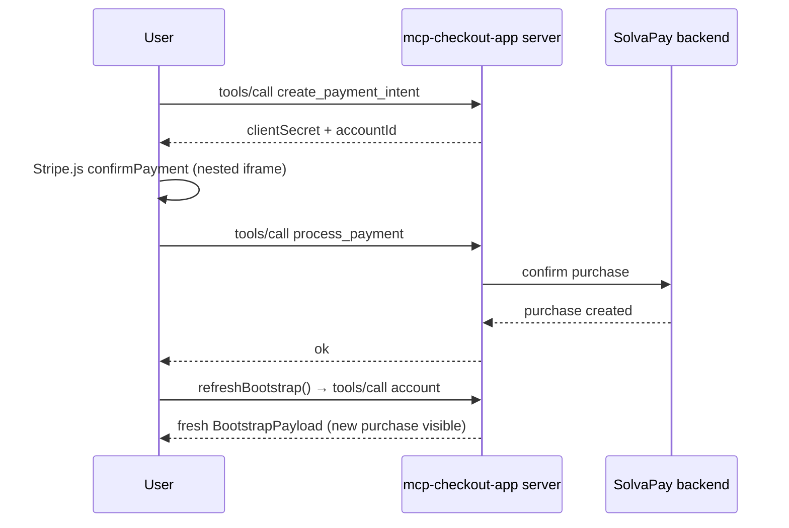
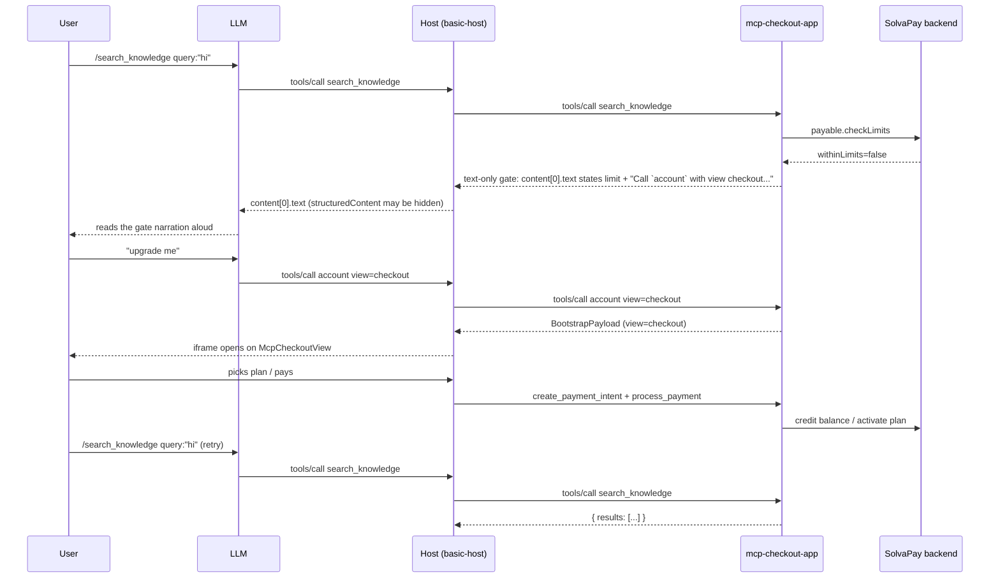

# MCP checkout app example

An MCP App that runs a **hybrid checkout** inside an MCP host's sandboxed
UI resource. On compliant hosts (hosts that honour the
[MCP Apps spec](https://modelcontextprotocol.io/docs/spec/app)'s
`_meta.ui.csp` extension, e.g. `basic-host`, ChatGPT) the UI mounts
Stripe Elements inline via the SolvaPay SDK's `<PaymentForm>` compound
primitive. On non-compliant hosts (today: Claude, which hardcodes
`frame-src 'self' blob: data:` and ignores `frameDomains`) the UI
detects the block via a runtime probe and falls back to launching
**SolvaPay hosted checkout** in a new browser tab.

## Choosing the right example

Four MCP examples ship in this repo. Start here if your product has a
full self-serve surface (plans, credit balance, top-up, usage); hop to
a sibling if you need less:

| Example                        | Runtime           | What it shows                                                        | Use when                                                                                           |
| ------------------------------ | ----------------- | -------------------------------------------------------------------- | -------------------------------------------------------------------------------------------------- |
| `examples/mcp-checkout-app`    | Node + Express    | Full 5-intent UI shell + embedded Stripe + paywalled demo data tools | You want the complete story — plan picker, checkout, top-up, usage meter, paywall                  |
| `examples/supabase-edge-mcp`   | Deno (Supabase)   | Same full toolbox as `mcp-checkout-app`, deployed to Supabase Edge   | You want the complete story running at the network edge with `createSolvaPayMcpFetchHandler`       |
| `examples/mcp-oauth-bridge`    | Node + Express    | Paywall-only, no UI, virtual tools only                              | You just need to gate a text-only tool behind SolvaPay usage limits                                |
| `examples/mcp-time-app`        | Node + Express    | Virtual tools + minimal UI, showcases the gate response              | You want the smallest possible paywalled MCP server                                                |

The MCP server holds `SOLVAPAY_SECRET_KEY` and exposes the trimmed
7-tool surface: 2 intent tools (`account`, `activate_plan`) plus 5
UI-only state-change tools (`create_hosted_session`, `create_payment_intent`,
`process_payment`, `set_renewal`, `attach_business_details`).
Product-scoped data (merchant, product, plans) and the customer
snapshot (purchase, payment method, balance, usage) ride on the
`BootstrapPayload` every intent tool returns, so the embedded form
never fires per-view read calls.

Earlier iterations gave up on the embedded path because older host
versions blocked `js.stripe.com` unconditionally — see
[`solvapay-sdk/.cursor/plans/mcp-checkout-app_hosted-button-pivot_b3d9c1a2.plan.md`](../../.cursor/plans/mcp-checkout-app_hosted-button-pivot_b3d9c1a2.plan.md)
for the original rationale. The spec's new `_meta.ui.csp` extension
makes that path viable again on hosts that implement it, and the
runtime probe keeps us safe on hosts that don't.

## Prerequisites

1. SolvaPay platform stack running locally (`npm run dev` / `npm run local` in
   the sibling `platform` repo). SDK calls go through the provider-app proxy at
   `http://localhost:3010` — see [`../.env.platform-local.example`](../.env.platform-local.example).
2. A product with at least one active plan (create in the console at `:3010`)
3. `SOLVAPAY_SECRET_KEY` scoped to that product
4. An MCP host such as [`basic-host`](https://github.com/modelcontextprotocol/basic-host)
   running at `http://localhost:8080`

## Configure

```bash
# Against a local platform stack, start from the shared template:
cp ../.env.platform-local.example .env
# Or: cp .env.example .env
# Fill in SOLVAPAY_SECRET_KEY and SOLVAPAY_PRODUCT_REF. Keep
# SOLVAPAY_API_BASE_URL=http://localhost:3010 and MCP_PORT=3030 (platform
# owns 3001–3012). The Stripe publishable key used for embedded Elements is
# fetched from the SolvaPay backend at boot (GET /sdk/platform-config) — no
# local config needed.
```

## Run

```bash
pnpm install
pnpm --filter @example/mcp-checkout-app build
pnpm --filter @example/mcp-checkout-app serve
```

Watch mode (rebuilds the UI bundle and restarts the server on changes):

```bash
pnpm --filter @example/mcp-checkout-app dev
# or from the SDK repo root: pnpm mcp:checkout
```

Point `basic-host` at `http://localhost:3030/mcp` and open the app from
its tool list. On `basic-host` and ChatGPT the iframe renders inline
Stripe Elements; enter the test card `4242 4242 4242 4242` and pay
without leaving the host. On Claude the probe detects that
`js.stripe.com` cannot iframe and the UI falls back to an **Upgrade**
button that opens hosted checkout in a new tab — returning to the host
fires `refreshBootstrap()` (which calls `account` with
`view: "account"` under the hood) and flips the card to **Manage purchase**.

For a public URL, run `pnpm tunnel` / `pnpm mcp:checkout:tunnel` (cloudflared)
or enable the platform `mcpapp` ngrok tunnel on `:3030`.

### Stub mode (no credentials)

Set `SOLVAPAY_STUB=1` to boot against `createStubClient` instead of a
live backend. The first payable tool call gates immediately (the
anonymous customer starts at the included cap). No real charges occur.

```bash
SOLVAPAY_STUB=1 MCP_PORT=3030 pnpm --filter @example/mcp-checkout-app serve
node packages/create-solvapay/templates/mcp/_base/scripts/verify.mjs http://localhost:3030
```

When `SOLVAPAY_STUB` is unset, `SOLVAPAY_SECRET_KEY` and
`SOLVAPAY_PRODUCT_REF` remain required.

## Text-only hosts

MCP Apps is optional. Claude Code, CLI clients, Grok, n8n, and any host
that ignores `ui://` never mount the checkout iframe. Official MCP
Apps / 2026-07-28 tools guidance: `content` is the model and text-only
lane; `structuredContent` is for the widget and is often hidden from
the model when `content` is present. Full contract:
[`docs/contributing/mcp-apps-host-contract.md`](../../docs/contributing/mcp-apps-host-contract.md).

A gated or account call on a text-only host must still:

1. **State current limits** — plan name (or "no plan"), remaining
   included usage or credit balance, and why this call was blocked.
2. **Guide the upgrade** — exactly one recovery call (`account` with
   the right `view`, or `activate_plan` when a `planRef` is known)
   plus a https URL in the same sentence.
3. **Find capabilities and user info** — `resources/read
   docs://solvapay/overview.md` for what the app can do;
   `account` with `view: "account"` for the signed-in customer's plan,
   remaining, and payment method.

Do not write `"shown in the panel."` as the first text block. There
is no panel.

Host-contract §5 recipe (no `mode` argument on any call). Against stub
mode, `search_knowledge` gates on the first call:

```bash
SOLVAPAY_STUB=1 MCP_PORT=3030 pnpm --filter @example/mcp-checkout-app serve
```

Then, with a raw JSON-RPC client (or `lib/mcp-client.mjs`):

1. `tools/call search_knowledge { query: "probe" }` — `content[0].text`
   names used/total included, the next-call price, one recovery tool,
   and a pasteable `https://` URL. No "in the panel."
2. `tools/call account { view: "account" }` — first text block states the
   customer's plan and remaining included usage or credit balance, plus
   a `[Manage account](url)` markdown link when a portal URL is present.
3. `tools/call account { view: "checkout" }` — first text block lists at least one plan
   with a price, a `planRef`, and a `https://` checkout path.
4. `resources/read docs://solvapay/overview.md` — capability overview.

The scaffolder `scripts/verify.mjs` asserts the same checks.

## Flow

```mermaid
sequenceDiagram
  participant U as User
  participant H as Host (basic-host)
  participant S as mcp-checkout-app server
  participant SP as SolvaPay backend

  U->>H: Select MCP App tool
  H->>S: tools/call upgrade (intent tool)
  S->>SP: parallel fetch merchant / product / plans / customer
  SP-->>S: snapshots
  S-->>H: content[0].text (self-sufficient) + BootstrapPayload (structuredContent) + UI resource URI
  H->>S: resources/read ui://mcp-checkout-app/mcp-app.html
  S-->>H: HTML + _meta.ui.csp
  H-->>U: iframe mounts
  U->>H: (React McpApp renders — provider seeded, probe runs)
  Note over U,H: Tab nav is local state; no further tool call on switch
```

Mutation path — e.g. user pays inside the iframe:


```mermaid
sequenceDiagram
  participant U as User
  participant S as mcp-checkout-app server
  participant SP as SolvaPay backend

  U->>S: tools/call create_payment_intent
  S-->>U: clientSecret + accountId
  U->>U: Stripe.js confirmPayment (nested iframe)
  U->>S: tools/call process_payment
  S->>SP: confirm purchase
  SP-->>S: purchase created
  S-->>U: ok
  U->>S: refreshBootstrap() → tools/call account
  S-->>U: fresh BootstrapPayload (new purchase visible)
```

1. Host loads `ui://mcp-checkout-app/mcp-app.html`. The resource
   registration declares `_meta.ui.csp` with Stripe's required
   `resourceDomains` / `connectDomains` / `frameDomains` — hosts that
   implement the spec propagate these to the iframe's CSP.
2. The bundle renders `<McpApp app={app} />` from
   [`@solvapay/react/mcp`](../../packages/react/src/mcp). `McpApp` runs
   `app.connect()`, calls `account` (landing screen from
   `structuredContent.view`) or `activate_plan`, seeds
   the provider's module caches via `seedMcpCaches(initial, config)`,
   and mounts `<SolvaPayProvider config={{ transport, initial }}>` so
   every hook reads from the snapshot without a first-mount fetch.
   `transport = createMcpAppAdapter(app)` only tunnels the 7 UI-only
   state-change tools — read tools (`check_purchase`, `get_merchant`,
   etc.) no longer exist; their data arrives on the `BootstrapPayload`.
3. On mount the UI calls `account`. The viewer parallel-loads
   merchant, product, plans, and (when authenticated) the full
   customer snapshot, plus SolvaPay's platform Stripe pk from
   `GET /sdk/platform-config`. A `useStripeProbe` hook races
   `loadStripe(publishableKey)` against a 3 s timeout to classify the
   host as `'ready'` (embedded), `'blocked'` (fallback) or `'loading'`
   (spinner). If `/sdk/platform-config` is unreachable or the key is
   unconfigured the tool returns `null` and the hosted fallback
   renders.
4. **Embedded branch (`probe === 'ready'`):** renders the SDK's
   `<PaymentForm.Root>` compound (`Summary` / `PaymentElement` /
   `Error` / `MandateText` / `SubmitButton`). Card entry happens in a
   nested `js.stripe.com` iframe; confirmation goes through
   `create_payment_intent` → Stripe.js `confirmPayment` →
   `process_payment`. Post-purchase the shell calls
   `refreshBootstrap()` and the card switches to `<CurrentPlanCard>`.
5. **Hosted branch (`probe === 'blocked'`):** the original hosted-button
   experience — `create_hosted_session` with `kind: "checkout"` populates an
   `<a target="_blank">` anchor, the user completes payment in a new
   tab, and `focus`/`visibilitychange` listeners fire
   `refreshBootstrap()` to flip to **Manage purchase**.

## Tools

**Intent tools (LLM-callable, dual-audience):**

| Tool | Purpose |
| --- | --- |
| `account` | Single viewer. Pass `view: "checkout"` (upgrade / change plan), `view: "account"` (plan, balance, cancel), or `view: "topup"` (add credits). Returns the `BootstrapPayload` (merchant, product, plans, customer snapshot, stripePublishableKey). Slash prompts `/upgrade`, `/manage_account`, `/topup` remap onto this tool. |
| `activate_plan` | With `planRef`: activates a free/usage-based plan or returns a checkout URL for paid plans. Without `planRef`: list plans via `account` with `view: "checkout"`. |

**UI-only state-change tools (tagged `_meta.audience: 'ui'`):**

| Tool | Purpose |
| --- | --- |
| `create_hosted_session` | Returns `{ sessionId, checkoutUrl \| customerUrl }` for hosted checkout (`kind: "checkout"`) or customer portal (`kind: "portal"`) |
| `create_payment_intent` | Creates the PaymentIntent for plan checkout (`purpose: "plan"`) or top-up (`purpose: "topup"`) |
| `process_payment` | Records the Stripe-side confirmation after `confirmPayment` resolves |
| `set_renewal` | Toggles auto-renewal (`enabled: false` to cancel, `enabled: true` to reactivate) |

`returnUrl` on hosted checkout is intentionally unset — there
is no meaningful URL to return to inside an MCP host iframe, so the
SolvaPay backend default is used.

### A note on `stripePublishableKey`

The publishable key every intent tool returns is **SolvaPay's platform
key**, sourced from the SolvaPay backend via `GET /sdk/platform-config`
(resolved sandbox/live against the authenticated provider's
environment). It is not the connected merchant's own pk. SolvaPay uses
Stripe Connect direct charges, so the browser-side pattern everywhere
in the SDK is `loadStripe(platformPk, { stripeAccount: connectedAccountId })`
— the merchant's own publishable key is never touched.

The key is forwarded on `BootstrapPayload.stripePublishableKey` purely
so `useStripeProbe` has a syntactically valid pk to pass to
`loadStripe()` when testing whether the host's CSP `frameDomains` lets
`js.stripe.com` mount. The real payment flow re-fetches the same pk
(plus the `accountId` the probe never sees) from
`create_payment_intent`, so the probe value is never fed into
`confirmPayment`. If the backend doesn't have a platform pk
configured for the provider's environment, or the
`/sdk/platform-config` call fails for any reason, the payload carries
`null` and every host falls back to the hosted-button branch.

## Trying the paywall

The example registers five paywalled demo data tools
([`src/demo-tools.ts`](src/demo-tools.ts)) so you can click through the full
story — call a business tool → hit the gate → resolve in the iframe →
retry — without hand-rolling a gated tool.

| Tool | Purpose |
| --- | --- |
| `search_knowledge` | Returns 3 deterministic stub snippets for a query. Wrapped with `solvaPay.payable().mcp()` so each call consumes 1 credit. |
| `get_market_quote` | Returns a deterministic fake price for a ticker. Same paywall semantics as `search_knowledge`. |
| `query_sales_trends` | Returns deterministic sales rows for a date range. When the customer is low on credits, appends a **plain-text `low-balance` nudge** to `content[0].text` that names `account` with `view: "topup"` — the data still rides on `structuredContent` and a trailing JSON text block. Exercises the text-only nudge suffix on `ctx.respond(options.nudge)`. |
| `predict_price_chart` | Oracle demo — returns history + forecast numeric arrays with an 80% confidence band for a ticker. Declares an `outputSchema`. The narration asks the model to draw a line-chart artifact; no host auto-renders `structuredContent` as a chart. |
| `predict_direction` | Oracle demo — returns an up/down verdict + confidence score `∈ [0, 1]` for a ticker over N days. Same seeded model as `predict_price_chart`. Declares an `outputSchema`. |

All five are gated behind the `DEMO_TOOLS` env var. Set `DEMO_TOOLS=false`
when you copy this example to your own repo — the demo tools and their
slash-command prompts (`/search_knowledge`, `/get_market_quote`,
`/query_sales_trends`, `/predict_price_chart`, `/predict_direction`)
disappear and your copy becomes a clean template.

### Dual-lane responses — neither field is enough alone

Neither `content` nor `structuredContent` reaches the model on every
host. Claude Desktop chat reads `content` and ignores
`structuredContent`. Claude Code prefers `structuredContent` and
drops text blocks. Grok Bot keeps only markdown in `content[].text`.
No host auto-renders `structuredContent` as a chart without a
declared `ui://` resource.

So every payable success emits both: a self-sufficient narration on
`content[0].text`, the payload on `structuredContent`, and (by
default) a trailing JSON text block (`dataInText: true`) so hosts
that drop either lane still hold the arrays. The SolvaPay widget
iframe is reserved for the **`account` viewer** (`view`: `checkout` /
`account` / `topup`). Slash prompts `/upgrade`, `/manage_account`,
`/topup` remap onto it.

Paywall responses on exhaustion are **plain text narrations**:
`content[0].text` carries the current limit, the reason, `account`
with the right `view` (or `activate_plan` when a `planRef` is known),
and `gate.checkoutUrl`. `isError` stays `false` so hosts don't
short-circuit on the error path.

Merchant payable tools do not advertise `_meta.ui.resourceUri` —
descriptor-advertising would force the iframe open on every silent
success. The widget only opens when the user (or LLM) deliberately
invokes `account`.

### `ctx.respond()` and text-only nudges

`query_sales_trends` shows the handler surface end-to-end:

```ts
handler: async ({ range }, ctx) => {
  const results = buildDeterministicRows(range)
  if (ctx.customer.balance < 1000) {
    return ctx.respond(
      { range, results },
      {
        units: results.length, // reserved for V1.1 — V1 ignores this
          nudge: {
            kind: 'low-balance',
            message: 'Low on credits. Call `account` with view: "topup".',
          },
      },
    )
  }
  return ctx.respond({ range, results }, { units: results.length })
}
```

- `ctx.customer` — cached snapshot of the pre-check `LimitResponseWithPlan`;
  values are ≤10s stale after mutations. Call `ctx.customer.fresh()`
  for a round-trip when freshness matters.
- `ctx.respond(data, options?)` — returns a branded envelope. V1
  supports `text` (content[0].text override), `nudge` (appended to
  `content[0].text` and also emitted as an embedded `resource` block
  so it survives on hosts that drop text when `structuredContent` is
  set), and `dataInText` (default `true` — appends `JSON.stringify(data)`
  as a trailing text block so hosts that ignore `structuredContent`
  still receive the payload; set `false` to skip the duplicate).
  Reserved: `units` (V1.1 variable-unit billing — V1 silently ignores
  the field for forward-compatible handler code).
- `registerPayable(..., { outputSchema })` — opt-in Zod schema
  forwarded to `tools/list`. Declaring it is a spec MUST: the server
  must then return conforming `structuredContent`. Never auto-derived.
- `ctx.gate(reason?)` — stops handler execution and routes a paywall
  response through the adapter's `formatGate` channel when
  merchant-side rules need to force the gate. Rare — the SDK fires
  the paywall automatically via the pre-check.
- Reserved stubs: `ctx.emit(block)` (V1 queues, V1.1 SSE emits),
  `ctx.progress(...)` / `ctx.progressRaw(...)` (V1 no-op), `ctx.signal`
  (V1 unaborted).

### How paywall / nudge reach the user

Payable merchant tools no longer advertise `_meta.ui.resourceUri` at
the descriptor level, so the host never opens the iframe for a
paywall or nudge response. Instead:

- **Paywall / activation gate** — `content[0].text` carries a plain
  narration: current limits, the reason, the recovery intent tool
  (`account` with the right `view`, or `activate_plan` when a
  `planRef` is known), and `gate.checkoutUrl`.
  The host renders the text; the LLM sees the same copy and calls the
  recovery tool, which mounts the widget for the deliberate checkout
  UX. Text-only hosts stop at the narration and the https URL.
- **Low-balance nudge** — merchant data rides on `structuredContent`
  unchanged, and the nudge message is appended to `content[0].text`
  as a plain-text suffix (and as an embedded resource block). The
  user sees the data and a gentle heads-up pointing at `account`
  with `view: "topup"`; nothing is blocked.

This is why the widget's `<McpApp>` mount now only handles two host
entry cases:

- **intent entry** (`toolInfo.tool.name === account`): call the
  viewer via `fetchMcpBootstrap`; `structuredContent.view` picks the
  landing screen.
- **other** (transport or no tool info): fall back to `account`
  with `view: "checkout"` for a fresh snapshot.

There is no third "data entry" branch any more — because there's no
widget to mount on a data-tool call.

### End-to-end recipe

1. Configure **three plans** on your product in the SolvaPay admin:
   **Free** (auto-active, ~50 calls / month quota), **Pay as you go**
   (`type: usage-based`, e.g. $0.01 / call), and a **Recurring** plan
   (e.g. $18 / month with included credits). The Free plan makes the
   paywall reachable by exhausting the free quota instead of by admin
   balance-zeroing; the two paid plans exercise the brief's PAYG and
   Recurring activation branches.
2. Start the example (`pnpm --filter @example/mcp-checkout-app dev`) and
   point `basic-host` at `http://localhost:3030/mcp`.
3. Customer is on Free by default. Call `/search_knowledge query: "hi"`
   N times; each call drains the free quota.
4. When the Free quota exhausts, the next call returns a **paywall
   gate** as plain text. `content[0].text` carries a narration like
   _"You don't have an active plan for this tool. Call `account` with
   view: \"checkout\" to pick a plan, or open https://.../checkout in
   a browser."_
   The LLM reads it, narrates for the user, and either (a) the user
   clicks the inlined URL and completes checkout in the browser, or
   (b) the LLM calls `account` with `view: "checkout"` which opens the
   SolvaPay widget on `<McpCheckoutView>`.
5. Inside the checkout view, plan cards render **paid plans only**
   (no Free card), with PAYG featured as `recommended` and the CTA
   label tracking the selected plan.
6. **PAYG branch:** pick Pay as you go → `Continue with Pay as you go`
   fires `activate_plan` (topup-first — a zero-balance customer gets
   `topup_required` and no purchase yet) → amount picker (presets 500 / 2 000 / 10 000
   credits, `popular` on 2 000) → Continue (local transition only) →
   payment step with inline Stripe Elements → `Pay $18.00` →
   `create_payment_intent` with `purpose: "topup"` + `process_payment` → the SDK
   re-activates the plan now that credits have landed, creating the
   active PAYG purchase → success surface with receipt grid (no CTA).
   The SDK auto-sends
   `Topped up $18.00. Ready to keep working.` to the chat via
   `app.sendMessage`, so the agent picks the conversation back up
   without a user click.
7. **Recurring branch:** pick Pro → `Continue with Pro — $18/mo`
   (skips amount picker) → payment step with order summary + terms
   line → `Subscribe — $18.00 / monthly` → `create_payment_intent`
   (subscription flag) + `process_payment` → success surface with
   next-renewal row + a Manage account markdown link (no
   CTA). SDK auto-sends `Activated Pro.` to the chat for the same
   continuation effect.

### Gate → upgrade intent → topup → retry sequence


```mermaid
sequenceDiagram
  participant U as User
  participant LLM as LLM
  participant H as Host (basic-host)
  participant S as mcp-checkout-app
  participant SP as SolvaPay backend

  U->>LLM: /search_knowledge query:"hi"
  LLM->>H: tools/call search_knowledge
  H->>S: tools/call search_knowledge
  S->>SP: payable.checkLimits
  SP-->>S: withinLimits=false
  S-->>H: text-only gate: content[0].text states limit + "Call `account` with view checkout..."
  H-->>LLM: content[0].text (structuredContent may be hidden)
  LLM-->>U: reads the gate narration aloud

  U->>LLM: "upgrade me"
  LLM->>H: tools/call account view=checkout
  H->>S: tools/call account view=checkout
  S-->>H: BootstrapPayload (view=checkout)
  H-->>U: iframe opens on McpCheckoutView

  U->>H: picks plan / pays
  H->>S: create_payment_intent + process_payment
  S->>SP: credit balance / activate plan

  U->>LLM: /search_knowledge query:"hi" (retry)
  LLM->>H: tools/call search_knowledge
  H->>S: tools/call search_knowledge
  S-->>H: { results: [...] }
```

## Known boundaries

- Plan switching (`change_plan`) and inline card-update
  (`create_setup_intent`) are in flight as follow-ups — see
  [`sdk_plan_management_phase2_6e40d833.plan.md`](../../.cursor/plans/sdk_plan_management_phase2_6e40d833.plan.md)
  for the deferred scope. `track_usage` is roadmap; every other
  state-change tool is already registered (see the Tools table above).
- Auth comes exclusively from `createMcpOAuthBridge` → `customer_ref`
  on `extra.authInfo`. There is no client-side auth adapter.
- Post-purchase account management (update card / cancel) stays on the
  hosted customer portal in both branches. The portal isn't safe to
  embed.
- The embedded branch depends on the host delivering `_meta.ui.csp.frameDomains`
  to the widget document. The runtime probe handles non-compliant hosts (Claude)
  and hosts where the declaration is read but the enforced policy still blocks
  nested iframes (MCPJam Inspector currently reports a runtime mismatch between
  its effective CSP model and the browser's enforced policy). When the probe
  blocks, check the widget console for `[solvapay-mcp] host CSP refused the
  Stripe iframe` — the logged `originalPolicy` names the policy that refused
  the frame. Adding entries to `_meta.ui.csp` cannot help when the host's
  sandbox proxy or iframe chain strips or overrides `frame-src`.

## Endpoints

- `GET /health`
- `GET /.well-known/oauth-protected-resource`
- `GET /.well-known/oauth-authorization-server`
- `POST /mcp`
- `GET /mcp`
- `DELETE /mcp`
